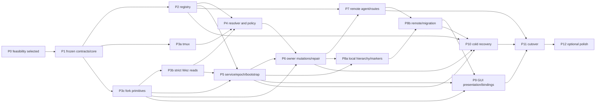

# dmux WezTerm-mux-first plan specification

Status: full plan specification; implementation is blocked until P0 selects and proves the low-level mechanisms named in this document  
Audience: the root implementation agent, specialist subagents, and future maintainers  
Scope: `dmux`, the WezTerm configuration and resurrection fork, shell wrappers, host routing, migration, tests, and rollout

## 1. Outcome

`dmux` becomes the provider-neutral control plane for persistent terminal work. A user works with Spaces, Groups, and Splits; dmux maps those concepts to either WezTerm mux or tmux without leaking backend policy into wrappers or keybindings.

The finished behavior is:

- Local graphical work is WezTerm unix-mux first.
- Wired remote graphical work is remote WezTerm mux first.
- Unwired remote creation and plain/headless SSH use tmux.
- An existing Space is always resolved before creation policy is evaluated.
- An existing remote Wez Space may reconnect through Tailscale when USB is unavailable.
- Once Wez has been selected, an authentication, protocol, compatibility, or mutation failure never silently creates a tmux Space.
- Every Space has durable dmux identity independent of name, backend-native handles, hostname, and route.
- Groups and Splits always inherit their Space's owner and backend.
- Normal GUI exit detaches from mux state; only explicit remove operations terminate panes.
- Resurrection is cold recovery for a newly started, empty mux server, not normal GUI restart behavior.

## 2. Locked product decisions

These decisions are normative. Implementation agents must not reinterpret them independently.

1. A Space has one immutable owner host, one immutable backend, one immutable dmux identity, and one mutable logical name.
2. A Group is a WezTerm tab or tmux window. A Split is a pane, including the initial/root pane. A new Space therefore has one Group and one Split.
3. WezTerm's native mux-window layer is hidden by enforcing exactly one mux window per managed Wez Space. Every managed Wez mutation checks this invariant before and after acting. A violating resource is `health=multi_window` and permits only listing, inspect/export, explicit normalization repair, or confirmed whole-Space removal; ordinary connect, rename, presentation, and child mutations fail closed.
4. Wez native workspace keys are opaque and stable, for example `dmux:<host-uid>:<space-uid>`. The friendly Space name lives in the dmux registry and GUI. This prevents same-named workspaces on attached domains from merging and makes logical rename identity-safe.
5. A logical Wez Space rename changes the registry/display name, not the opaque native workspace key. A tmux rename changes the tmux session name and registry atomically through a mutation journal.
6. The owner host is the sole authority for Space allocation, adoption, mutation journals, and tombstones. A client never assigns an ID to a remote Space from a cached listing.
7. `dmux ls` is semantically read-only: it may publish an observation/cache record under the scan API, but never allocates identity, changes lifecycle, or mutates a native resource. External resources appear as `unmanaged` with provider-qualified native refs. Only explicit `dmux adopt` or migration may allocate identity or mutate a native resource, and Wez adoption remains disabled until P0 proves an atomic/fenced normalization primitive.
8. Space identity is durable. Group and Split handles in the first release are live, Space-scoped handles tied to a backend server epoch; they must be refreshed after any backend-server restart, including cold recovery. Durable child IDs are a later extension.
9. Route failover may change USB to Tailscale only while staying on the same verified host and backend instance. Backend fallback is never a route operation.
10. A failed or partial inventory is not an empty inventory. Creation fails closed when dmux cannot rule out an existing same-named Space.
11. `new` is idempotent create-or-connect. `con` never creates. `con --create` is deprecated and removed after one compatibility release.
12. Duplicate names across backends are an error unless the user explicitly constrains the backend. Intentional creation beside an opposite-backend match additionally requires `--allow-name-collision`.
13. Normal quit/disconnect must preserve owner-side pane counts and process IDs. `QuitApplication` is not a safe implementation of that contract.
14. The full Wez-first default remains feature-gated until identity, complete inventory, explicit Wez mutations, persistent-domain lifecycle, safe disconnect, and cold-recovery guards have all passed their gates.
15. Each owner has exactly one managed unix-Wez backend instance and one default tmux server namespace in the first release. Additional sockets/servers are listed as unmanaged until a later multi-instance design.
16. The managed Wez mux is service-owned on both Linux and macOS. Dmux may ask the OS user-service manager to start it and wait for a verified readiness handshake; Wez CLI/domain auto-start is disabled and is never an alternate owner.
17. P0 is an implementation gate, not a coding phase. No public schema freezes and P1 does not begin until one feasible strict-endpoint, attach/presentation, bridge, atomic adoption, provisional pane-bootstrap/correlation/orphan-recovery, and cold-start mechanism has been demonstrated and selected.

## 3. Goals and non-goals

### Required before the Wez-first cutover

- Provider-neutral `ls`, `new`, `con`, `rename`, `rm`, `disconnect`, and `dmux -` for Wez and tmux.
- Stable Space identity and short routable references on the local host and enrolled remotes.
- Local and remote owner-side Wez inventory using the standalone mux server.
- Exact-existing-first resolution, actionable duplicate-name errors, and typed failure classification.
- Local persistent unix mux as the normal GUI startup domain.
- Explicit local and remote Wez create/connect/rename/remove flows.
- Backend-aware creation, selection, rename, navigation, resize, zoom, and close bindings for Groups and Splits.
- Safe GUI disconnect/quit.
- Owner-side cold recovery that never restores into a nonempty mux.
- Explicit adoption plus normalization/quarantine of every external multi-window Wez resource before cutover.
- Migration of current sessions and previous-Space history.
- Simple `ssa` and `ssm` forwarding wrappers.

### Required to complete the full requested surface

- `dmux ls --tree` and all-host aggregation.
- `group` and `split` list/new/connect/rename/remove commands.
- `host ls`, `host label`, `host forget`, and `dmux ssh` enrollment.
- `inspect`, a decision-explaining `doctor`, and richer route/version diagnostics.
- GUI Space picker, named-Space prompt, Group rename/close, mixed-pane indicator, and safe close semantics.

### Explicit non-goals

- Automatic conversion or migration of a live Space from one backend to the other.
- Silently nesting a tmux Space under an outer Wez Space in the logical tree. Both native roots remain separate Spaces; the active pane's innermost valid dmux marker defines the current logical Space.
- Treating a physical cable probe as proof of Wez authentication or compatibility.
- Restoring live process IDs after reboot or mux-server death. Cold recovery reconstructs eligible shells, layout, cwd, titles, and optional scrollback; normal GUI reattachment is what preserves live processes.
- Stable, bookmarkable Group/Split IDs across mux-server generations in the first release.
- Inferring owner/backend from foreground process names.

## 4. Current baseline and change seams

The current implementation has a strong test harness but a backend-asymmetric model:

- Named creation always produces tmux in `scripts/rust/crates/dmux/src/attach.rs` around `new_session_in` and `plan_new`.
- Wez inventory is local-only and runs without `--prefer-mux`; remote Wez rows are omitted in `scripts/rust/crates/dmux/src/list.rs`.
- Numeric targets are sorted row positions regenerated on every scan.
- Duplicate exact names silently prefer tmux.
- Wez connect only activates a pane in an already attached GUI; Wez rename/remove/disconnect are rejected.
- Host identity is the hard-coded `Macie|Archie` enum with compiled-in USB and Tailscale addresses.
- `state.rs` prevents torn files but does not lock read-modify-write allocation.
- The current suite has 116 passing dmux tests: 37 unit, 73 CLI, and 6 real-shell remote round-trip tests. Preserve the quoting and dry-run coverage while replacing the old product semantics.
- WezTerm declares the `unix` domain but does not make it the normal startup domain.
- Current macOS keys map Command+Q to destructive `QuitApplication`, Command+W to unconfirmed tab close, and creation/navigation directly to outer Wez tabs and panes.
- The resurrection fork always registers `gui-startup` restoration and restores one current workspace; this is incompatible with attach-only GUI startup and all-Space cold recovery.

Primary Rust seams:

```text
scripts/rust/crates/dmux/src/main.rs       CLI wiring only
scripts/rust/crates/dmux/src/attach.rs     split into orchestration/providers
scripts/rust/crates/dmux/src/list.rs       replace transient Row model
scripts/rust/crates/dmux/src/hosts.rs      replace hard-coded identity/routes
scripts/rust/crates/dmux/src/state.rs      retain only lightweight history
scripts/rust/crates/dmux/src/doctor.rs     typed capability/decision report
scripts/rust/crates/dmux/tests/**          preserve and extend harnesses
```

Primary lifecycle/UI seams:

```text
shared/wezterm/wez/domains/init.lua
shared/wezterm/wez/remote/**
shared/wezterm/wez/keys/**
shared/wezterm/wez/appearance/status.lua
shared/wezterm/wez/plugins/resurrect.lua
shared/wezterm/wez/plugins/workspace_picker.lua
shared/zsh/conf.d/91-tmux-attach.zsh
macos/hammerspoon/init.lua
linux/arch/wezterm-mux/wezterm-mux.service
the fredrir/resurrect.wezterm fork
```

## 5. Domain model

### 5.1 Provider-neutral hierarchy

| dmux | WezTerm | tmux | Required semantics |
| --- | --- | --- | --- |
| Space | workspace containing exactly one mux window | session | Stable dmux identity; mutable friendly name |
| Group | tab | window | Belongs to one Space; backend and owner inherited |
| Split | pane | pane | Belongs to one Group; initial pane counts as Split 1 |
| Connect | attach domain if needed, select workspace, optionally activate tab/pane | attach or switch client, optionally select window/pane | Never creates |
| Disconnect | switch away, or detach a domain explicitly | detach invoking client | Never kills panes |
| Remove | kill every pane in the opaque workspace and verify absence | kill session | Confirmed and tombstoned |

Group titles are mutable, non-unique display metadata and never resolve a Group reference. Splits are unnamed. In v1, child identity is only the epoch-qualified live provider handle; parentage and counts are revalidated from a complete live scan.

### 5.2 Space state

Registry lifecycle and observation state are separate:

```text
lifecycle: reserved | active | deleting | deleted | conflict | aborted
observation: live | absent | stopped | unreachable | incompatible | unmanaged
health: healthy | multi_window | native_key_collision | unstamped | unknown
client: attached | detached | unknown
```

A backend instance — the registry row behind every managed Space of one backend — has six distinguishable states, named A–F (ADR 012 §3.1, review report 04): A not registered; B registered without an endpoint; C registered, unpublished, idle; D registered, unpublished, with the exclusive instance lease held (a bootstrap or recovery in flight); E published and the live server agrees; F published but the live server disagrees or the published process is dead (`stale_incarnation`). A published epoch is never proof of a live server: readers verify pid liveness, the start token, and the socket dev/ino against a fresh `stat` before treating E as established, and every mutation refuses F. Space rows under an F instance render `observation: unreachable` with `detail: stale_incarnation`; the operator advice is to restart the managed service only when it holds no user panes, and otherwise `dmux repair retire-incarnation` once the service is confirmed down. `dmux ls` and `dmux doctor` distinguish C from D (lease probe) and E from F (liveness probe) and never collapse them.

Absence never creates a deletion tombstone. Only a successfully verified explicit removal does.

### 5.3 Nested and mixed contexts

- A tmux session running inside a Wez pane is a separate tmux Space, not a child of the outer Wez Space.
- The active pane's valid marker selects the current logical Space. When tmux exits, the outer shell prompt restores the outer Wez marker.
- A physical Wez tab containing markers for multiple hosts/backends is `mixed`. Status follows the active pane and displays a `MIXED` warning. Destructive shortcuts require an exact active marker and never act on the entire physical tab by guesswork.

## 6. Identity and references

### 6.1 Identity types

| Type | Meaning | Lifetime |
| --- | --- | --- |
| `HostUid` | Random UUIDv4 for one dmux installation authority | Permanent unless explicit rekey |
| `SpaceUid` | Random UUIDv7 for one Space lifecycle | Permanent and globally unique |
| `SpaceNo` | Per-owner monotonic display number | Permanent; never reused |
| `HostAlias` | Registry-relative shorthand (`a`, `b`, ..., `aa`) | Never reassigned to a different HostUid |
| Host label | Mutable human label such as `archie` | A locator alias, not identity |
| Route | USB, Tailscale, LAN, or other path to one HostUid | Mutable and replaceable |

The strongest canonical reference is:

```text
dmux://<host-uid>/spaces/<space-uid>
```

The requested portable numeric reference remains supported:

```text
<host-uid>:<space-no>
```

Its non-reuse guarantee depends on preserving the owner's registry and tombstones. `SpaceUid` prevents a rolled-back counter from silently reusing the same canonical Space identity; clone and rollback detection itself comes from `RegistryUid`, authority lineage/revision checks, and route handshakes.

### 6.2 Human reference grammar

```text
2                  SpaceNo 2 on this machine (`a:2`)
b2                 compact display/command shorthand for host alias b, SpaceNo 2
b:2                unambiguous expanded relative reference
b:project          exact logical name on host b
archie:project     exact logical name on the locally enrolled label archie
<host-uuid>:2      portable owner-qualified numeric reference
dmux://...         strongest canonical identity
```

Parsing precedence is structural:

1. Canonical URI.
2. Full HostUid plus SpaceNo.
3. Expanded alias/label plus SpaceNo.
4. Bare digits as local SpaceNo.
5. Compact alias plus digits.
6. Host-qualified logical name.
7. Bare logical name on the resolved/current host only.

`SpaceNo` is canonical nonzero decimal `[1-9][0-9]*`; `0` and leading-zero forms are invalid refs and are not reinterpreted as names. Any `<host-token>:<digits>` is parsed as an owner-qualified numeric ref before name lookup. An unknown/tombstoned host token is therefore an error, never a fallback to a logical name.

Names are case-sensitive. New dmux names use `[A-Za-z][A-Za-z0-9_-]{0,63}`. The fixed lexical class `^[A-Za-z]+[0-9]+$` and bare `^[0-9]+$` are ID-shaped even when the apparent alias is not currently enrolled; this classification never changes as hosts are added. URI prefixes, strings containing `:`, and child-ref syntax are also reserved by the new-name grammar. External legacy names remain operable by stable ID or an explicit `--name` selector. Bare names are never searched across all hosts.

Host labels are lowercase ASCII `[a-z][a-z0-9-]{0,31}`. They are matched case-sensitively, cannot equal a compact alias or reserved command word, and are unique across both current and historical labels in one client registry. Relabeling retains the old spelling as a historical ref to the same HostUid; no label or alias spelling is ever rebound to another HostUid.

`a` always means the local authority. Remote aliases start at `b`, roll over `z -> aa`, and are relative:

```text
On Macie:  a = Macie,  b = Archie
On Archie: a = Archie, b = Macie
```

Forgetting a host tombstones its alias. Re-enrolling the same HostUid restores that alias; a different HostUid never receives it.

Top-level host defaulting is deterministic: an encoded ref wins, then explicit `--host`, otherwise bare names and `new` use local authority `a`. Only child shorthand may derive its parent from a revalidated active-pane marker. GUI bindings that intend the active pane's remote owner always pass that resolved owner explicitly; a remote shell/process alone never changes scope.

### 6.3 Child references

Group and Split references are scoped to a Space and full server-epoch UUID. For relative/numeric/name Space refs the canonical child suffixes are:

```text
<SPACE_REF>/g<EPOCH_UUID>.<PROVIDER_HANDLE>
<SPACE_REF>/p<EPOCH_UUID>.<PROVIDER_HANDLE>
```

Canonical URI children use:

```text
dmux://<HOST_UID>/spaces/<SPACE_UID>/groups/<EPOCH_UUID>/<PROVIDER_HANDLE>
dmux://<HOST_UID>/spaces/<SPACE_UID>/splits/<EPOCH_UUID>/<PROVIDER_HANDLE>
```

`PROVIDER_HANDLE` is `wz-<decimal>` for Wez tab/pane IDs, `tx-<decimal>` for a tmux `@<decimal>` window or `%<decimal>` pane, and otherwise `x-<base64url-no-padding>` for a future opaque provider handle. Shell metacharacters never appear in a ref. Human output may additionally show `g3` or `p4`; the number is the provider-native numeric component, never a list ordinal. Such a short handle is accepted only when an explicit Space ref supplies the current epoch or a trusted marker has been revalidated against the authoritative registry and a complete live provider scan for the same epoch. A Split ref implies its Group. After a server restart or cold recovery, callers must refresh `ls --tree`; stale epoch-qualified refs fail rather than retarget.

## 7. CLI contract

### 7.1 Top-level commands

`--format human|json` is a global option accepted exactly once anywhere before the command's `--` program separator; canonical examples place it immediately after `dmux`. It applies to every bounded command. Picker/interactive attach commands reject JSON, except `new --no-connect`, which is bounded.

```text
dmux [--format human|json] <COMMAND> ...
dmux                                      # interactive picker; never implicit-create
dmux <SPACE_REF>                          # shorthand for dmux con
dmux -                                    # previous distinct Space by stable identity

dmux ls [--host H | --all-hosts] [--backend wez|tmux]
        [--tree] [--format human|json]

dmux new NAME [--host H] [--backend auto|wez|tmux]
        [--dir PATH] [--no-connect] [--allow-name-collision]
        [--launch-gui] [-- CMD...]

dmux con (SPACE_REF | --name NAME) [--host H] [--backend wez|tmux]
        [--group GROUP_REF | --split SPLIT_REF] [--launch-gui]

dmux rename (SPACE_REF | --name OLD_NAME) NEW_NAME [--host H]
        [--backend wez|tmux] [--allow-name-collision]
dmux rm (SPACE_REF... | --name NAME | --all) [--host H] [--backend wez|tmux]
        [-y|--yes]
dmux disconnect [--domain]

dmux adopt NATIVE_REF [--name NAME] [--host H]
dmux repair normalize (SPACE_REF | NATIVE_REF) [--host H] [-y|--yes]
dmux repair rebind SPACE_REF NATIVE_REF [--host H] [-y|--yes]
dmux repair reconcile [SPACE_REF...] [--host H] [-y|--yes]
dmux repair retire-incarnation --backend (wez|tmux) --epoch UUID [--allow-live-pid] [-y|--yes]
dmux context stamp SPACE_REF

dmux inspect SPACE_REF [--format human|json]
dmux doctor [--host H] [--format human|json]
dmux doctor --explain-new NAME [--host H] [--backend auto|wez|tmux]

dmux recovery status [--host H] [--format human|json]
dmux recovery resume [--host H]
dmux recovery abort [--host H] [-y|--yes]
```

### 7.2 Group and Split commands

```text
dmux group ls [SPACE_REF] [--host H | --all-hosts] [--format human|json]
dmux group new SPACE_REF [--name NAME] [--dir PATH] [--no-connect] [-- CMD...]
dmux group con GROUP_REF
dmux group rename GROUP_REF NEW_NAME
dmux group rm GROUP_REF... [-y|--yes]

dmux split ls [GROUP_REF] [--host H | --all-hosts] [--format human|json]
dmux split new GROUP_REF [--direction left|right|up|down] [--percent N]
        [--dir PATH] [--no-connect] [-- CMD...]
dmux split con SPLIT_REF
dmux split rm SPLIT_REF... [-y|--yes]
```

Group/Split commands reject `--backend`; inheritance is mandatory.

Removing the last Split would remove its Group, and removing the last Group would remove its Space. The CLI refuses that hidden cascade and directs the caller to the parent-level remove. GUI actions may offer a second, explicitly worded parent-removal confirmation.

### 7.3 Host commands

```text
dmux host ls [--format human|json]
dmux host label HOST_REF NEW_LABEL
dmux host forget HOST_REF [-y|--yes]
dmux ssh HOST_OR_ADDRESS
```

`host ls` lists hosts and routes only. Spaces belong to `dmux ls`. `--all-hosts` controls host breadth; `--tree` controls hierarchy depth. The old overloaded `ls --all` is not retained; `-a` may be a compatibility alias for `--all-hosts` for one release only.

### 7.4 Behavioral rules

- Bare `dmux` requires an interactive terminal. With no TTY, it exits usage error and suggests `dmux ls --format json`.
- `new` connects an existing exact match or creates once; `--no-connect` makes it a bounded automation operation.
- `con`, `rename`, `rm`, and child operations never create.
- `--backend auto` is valid only for `new` and `doctor --explain-new`. Other commands accept `wez|tmux` only as a lookup constraint/filter.
- A backend constraint contradicting a stable ID is an error, never reinterpretation.
- A host encoded in a ref conflicts with a different `--host` and produces a usage error.
- `rm --all` means every Space on exactly one selected host, optionally backend-filtered. Cross-host bulk removal is forbidden.
- `disconnect` is canonical. `detach` remains a deprecated alias for one release.
- `con --create`, `ls --wez`, and `ls --tmux` emit migration hints before removal; replacements are `new` and `--backend`.
- `--name` is the exact-name escape for an adopted legacy name that looks like a ref or subcommand. It is mutually exclusive with a positional Space ref and never performs fuzzy or cross-host search.
- `--format json` is valid for `new` only with `--no-connect`; `con`, bare picker, and other terminal-handoff forms reject it before mutation. JSON destructive commands never prompt: without `--yes` they emit one `confirmation_required` document, change nothing, and exit 5.
- Connecting a Wez Space without a live trusted GUI bridge exits 6 unless `--launch-gui` was explicitly requested. Automatic policy never launches a GUI implicitly.
- When connection is requested, Wez presentation capability is preflighted before identity reservation or native creation. `--launch-gui` conflicts with `--no-connect` and is invalid for tmux. If verified creation succeeds but a later presentation step fails, report `created=true, connected=false` with the stable ref and partial exit 7; never abort/tombstone the live Space or fall back to tmux.
- Managed create/rename rejects a cross-backend logical-name collision by default. `--allow-name-collision` is an explicit expert acknowledgement and never changes a Space's backend.
- `repair reconcile` resolves a mutation whose process died mid-flight, routing each stranded row through the §10.2 journal's own resume decision rather than a second judgement. It distinguishes crashed from running by trying the locks a live mutation would hold: nothing durable separates them, and elapsed time is not evidence. A scope still held is reported and left alone. It never binds an orphan to a reserved key — that needs the bootstrap acknowledgement `new` performs and `repair` cannot — so that case refuses and names `repair rebind`.
- `NATIVE_REF` is an opaque provider-qualified token emitted for an unmanaged row, of the form `native:<backend>:<base64url-no-padding>`. It is never accepted as a backend command string. `adopt` re-resolves the token in a complete owner scan before acquiring its operation lease.

`repair rebind SPACE_REF NATIVE_REF` (ADR 012 WS-D.1) is an expert, confirmed, owner-local
assertion that one exact unmanaged native resource is a previously managed Space whose current
binding no longer answers. It refuses before any mutation when the Space's binding still answers
under the published incarnation (`identity_conflict`; rename or remove instead), when the resource
is bound to any Space or carries foreign markers (`identity_conflict`), when the backend of the ref
and the Space differ (`backend_mismatch`), when the instance has published no epoch or its published
incarnation is stale (`backend_epoch_changed`), and for a Space on another host (`protocol_mismatch`,
ADR 011 D7). It takes the locks and uses the primitive adoption uses — tmux: the session-id binding
plus the `@dmux_*` stamp; Wez: the fork CAS rename to the Space's own opaque key with
`--if-workspace`/`--if-sole-window` (ADR 006) — journals source and destination before the native
step, severs the old binding, prints both identities, and finishes `unstamped` until every pane runs
`dmux context stamp`. A JSON run without `--yes` emits one `confirmation_required` document and
changes nothing; a pipe without `--yes` exits 5. A rebind that dies mid-flight is settled by
`repair reconcile` into `rebind_rolled_back`, `rebind_committed` (active, unstamped) or conflict,
by the journaled source, destination and epoch — the adoption journal records the source native
token (registry schema v5, WS-D.2), so a crashed Wez adopt is reversed to its source, never to the
logical name.

`repair retire-incarnation --backend (wez|tmux) --epoch UUID` (ADR 012 WS-B.3) is an expert,
confirmed, owner-local clear of a published incarnation whose process is gone — the operator's move
for instance state F (§5.2) when the managed service will not come back managed. It compares-and-sets
on the published epoch (`--epoch` must equal the row's published epoch, else `backend_epoch_changed`),
nulls the published incarnation columns, and advances the authority revision chain so the retirement
is journaled like a publication. It refuses a still-live published pid without `--allow-live-pid`, a
mismatching epoch, and any unfinished recovery generation, and it never touches the native server.
A global `--host` naming another enrolled host is refused `protocol_mismatch` like `rebind`
(ADR 011 D7); this host's own alias or HostUid is not remote.
Afterwards the instance resolves as Unpublished (state C) until a managed start or bootstrap publishes
a fresh epoch. A managed start performs the same retirement itself before publishing (ADR 012
WS-B.3: `recovery::publish_incarnation_if_needed`), so the verb is needed only when no managed
start will come. `dmux recovery abort` keeps its own meaning.


## 8. Resolution and creation policy

### 8.1 Typed inventory outcomes

Every provider returns one of:

```text
complete inventory (possibly zero rows)
owner-proven server stopped
unreachable
authentication failure
host-key/identity failure
command missing
version mismatch
protocol mismatch
malformed response
timeout
permission failure
```

Only a complete inventory or an owner-local, identity-checked proof that the selected server process is stopped establishes zero live native rows. Both are determinate outcomes, but neither erases a durable registry match. A remote connection failure is `unreachable`, never proof that its server is stopped/empty. A published incarnation whose process is dead, whose start token has changed, or whose socket dev/ino no longer matches a fresh `stat` is `unreachable` with detail `stale_incarnation` (instance state F, §5.2); it is never `owner-proven server stopped`, because nothing verified has answered.

Every owner Wez probe targets the single enrolled backend instance by its service-published exact unix socket, never by configuration order or bare `--prefer-mux`. The command starts from a sanitized environment, then sets `WEZTERM_UNIX_SOCKET` to the recorded socket and always uses `--no-auto-start`. Before and after any operation it verifies the runtime descriptor, socket identity, service process start token, and the reserved mux sentinel's backend-instance/epoch nonce. A mismatch yields `backend_epoch_changed` or `wrong_backend_instance`; returned native IDs are discarded. P0 must prove this selector/handshake against two configured unix domains and a socket-replacement race, or select and freeze a forked strict selector instead.

### 8.2 `new` algorithm

For `dmux new NAME`:

1. Resolve host scope.
2. Treat the operand as a literal exact name for lookup, even if it would be invalid for a newly created managed name. Acquire the owner's durable per-logical-name decision lease for its exact case-sensitive bytes.
3. Obtain complete owner-side inventories for both backends, concurrently and with bounded timeouts.
4. Join those scans to the authoritative registry and surface unmanaged native names; listing/discovery does not adopt.
5. Partition exact same-name results before policy:
   - `selectable`: managed `lifecycle=active`, `observation=live`, `health=healthy`, with one verified native binding;
   - `blocking`: reserved/deleting/conflict, active but absent/stopped/unreachable, unmanaged, unhealthy/unstamped, duplicate binding, or recovery/mutation in progress;
   - terminal history: deleted/aborted, which never matches but keeps its identifiers unavailable.
   Any blocking result in the relevant lookup scope returns its typed state/conflict error; it is never counted as the "one match" below.
6. With auto backend:
   - exactly one selectable result and no blocking result: select/return it;
   - two selectable results: ambiguity error listing both stable refs;
   - no selectable/blocking results: validate `NAME` against the managed-name grammar and evaluate automatic creation policy.
7. With explicit backend `B`:
   - selectable result on `B`: select it irrespective of the opposite provider for this noncreating operation, because the backend constraint is authoritative;
   - blocking result on `B`: return its typed state error;
   - no result on `B`, selectable managed result only on the opposite backend: name-conflict error, or validate/create on `B` only with `--allow-name-collision`;
   - no result on `B` plus an opposite unmanaged/blocking result: return conflict/repair-required even with `--allow-name-collision`;
   - no results: validate `NAME` and create on `B`.
8. Immediately before any creation, re-scan both providers under the decision lease, reserve identity/journal intent, then acquire the selected backend-instance mutation lease in that lock order.
9. Create exactly one native resource, stamp/bind it, re-query both providers, and finalize or report an external-race conflict.
10. Release leases and connect the selected/created Space unless `--no-connect` was given. `--no-connect` never attaches even when the match already existed.

Auto lookup requires determinate inventories from both providers; one known match plus one indeterminate provider cannot exclude ambiguity. With explicit backend `B`, a complete `B` inventory containing an exact live match may select that match even if the opposite provider is indeterminate, because neither creation nor backend ambiguity resolution is needed. Every path that may create requires determinate inventories from both providers. `--allow-name-collision` is valid only with explicit `--backend wez|tmux`; it never waives unavailable-inventory safety.

Exact-name resolution is never limited to live rows. If a blocking active Wez record's service is stopped, dmux may start that fixed service, allow §15.3 recovery to finish, and repeat the partition. If no healthy live binding reappears, return `space_absent`/the specific health error with an inspect/repair hint; do not allocate a replacement identity. `deleted` and `aborted` rows do not match, but their UIDs/numbers remain unavailable forever.

Concurrent `new` requests for the same exact name serialize on the owner; a later auto request returns the first completed Space. Rename takes decision leases for old and new names in lexical byte order. An external native mutation that races the final pre/post scans becomes explicit `conflict`; dmux never silently deletes either object to make policy appear atomic.

### 8.3 Automatic creation decision

| Situation after no exact match | Result |
| --- | --- |
| Local, trusted Wez controller/bridge, compatible persistent unix mux | Wez |
| Local plain/headless/untrusted stale Wez environment | tmux |
| Remote, trusted Wez controller, positively usable USB Wez route, compatible versions | Wez |
| Remote USB route absent/unwired | tmux |
| Plain/headless SSH even over a physical USB link | tmux |
| Explicit `--backend wez` | Wez over an explicitly usable verified route, including Tailscale |
| Explicit `--backend tmux` | tmux |

"Positively usable" is stronger than a TCP probe: the controller must support Wez domain operations; SSH host identity, authentication, remote dmux protocol, and Wez version compatibility must pass; and the domain must attach/preflight without creating an unwanted pane.

Only a positively observed pre-selection `route_absent`/`usb_link_down` (no enrolled USB route or an authoritative link-state signal) makes USB ineligible and permits automatic tmux selection. DNS failure, refusal/reset, and timeout are not proof of "unwired"; during eligibility preflight they return route unavailable rather than choose tmux. After Wez is selected, another enrolled route may be tried only for a pre-authentication transport failure: DNS failure, no route, connection refusal/reset, or connect-stage timeout. Before continuing, the alternate route must verify the expected HostUid, RegistryUid, backend-instance identity/epoch, SSH trust, and compatible protocol. Host-key, identity, authentication, permission, protocol/version, malformed-response, server, native-mutation, and postcondition failures are terminal. An unknown mutation outcome may be retried only with the same request UID. None of these cases permits backend fallback.

### 8.4 Existing remote Wez Spaces

An existing Wez Space retains its backend. Connection tries verified routes in priority order:

1. USB.
2. Tailscale.
3. Other explicitly enrolled routes.

Only the pre-authentication transport failures enumerated in §8.3 may try the next route. Every other failure stops immediately. A route change never changes host, backend instance, server epoch, or Space identity within one operation plan. Observing a new server epoch invalidates that plan/any child ref and requires fresh owner resolution; it is not route failover continuation.

## 9. Architecture

### 9.1 Control planes

The design separates three responsibilities:

1. **Owner control plane** — runs on the host that owns the Space, queries/mutates the local tmux or standalone Wez mux server, and owns the registry.
2. **Client routing plane** — resolves local aliases, labels, and routes; invokes the owner through a versioned SSH agent; and records client-side previous-Space history.
3. **GUI presentation plane** — attaches/detaches Wez domains, switches visible workspaces, focuses presentation, handles backend-aware keys, and renders status.

Direct owner-server IDs must not be sent to a GUI CLI endpoint because imported Wez domains can remap IDs. The owner returns epoch-qualified logical child refs. After import, the GUI correlates those refs to GUI-local tabs/panes through revalidated `DMUX_GROUP_REF`/`DMUX_SPLIT_REF` user variables and activates only the correlated GUI-local object.

### 9.2 Rust module target

```text
src/model.rs                 Backend, Space, Group, Split, states
src/refs.rs                  parsers and formatted references
src/error.rs                 typed errors and exit mapping
src/registry/mod.rs          transactions and public registry API
src/registry/schema.rs       versioned SQLite migrations
src/registry/reconcile.rs    adoption and scan reconciliation
src/locks.rs                 POSIX scoped locks and lock ordering
src/backend/mod.rs           provider traits and normalized results
src/backend/tmux.rs          tmux adapter
src/backend/wez.rs           standalone owner mux adapter
src/inventory.rs             concurrent scans and aggregation
src/resolve.rs               exact resolution only
src/policy.rs                creation decision and explanation
src/operations.rs            create/rename/remove journals
src/routes.rs                host and route capability selection
src/remote/protocol.rs       versioned owner-agent messages
src/remote/client.rs         fixed SSH invocation and retries
src/gui.rs                   bridge request plans, never destructive rm
src/recovery.rs              fenced registry/service recovery coordination
src/runtime.rs               secure Linux/macOS runtime-directory resolver
src/bootstrap.rs             provisional pane request/broker state machine
src/history.rs               stable previous/current refs
src/output.rs                human and versioned JSON rendering
src/bin/pane-bootstrap.rs    internal marker bootstrap and exact exec
```

Provider implementations do not resolve names, select backends, write the registry directly, choose routes, or render user output. They accept exact native locators and return normalized typed results.

### 9.3 Provider contract

Each provider implements:

```text
capabilities()
inventory(scope) -> InventoryOutcome
create(CreateSpec) -> NativeBinding
prepare_presentation(binding, optional child) -> verified PresentationTarget
rename(binding, logical/native rename spec)
remove(binding) -> verified postcondition
group_list/new/activate/rename/remove
split_list/new/activate/remove
inspect(binding)
```

Backend selection occurs above this interface. A provider must never call the other provider. Wez presentation/disconnect is owned by GUI orchestration, not by the owner provider. A tmux `PresentationTarget` is converted to a locally validated attach/switch or the dedicated remote streaming channel in §12.1; it is not sent over the bounded JSON mutation RPC.

## 10. Registry and crash safety

### 10.1 Storage

Use SQLite at `$XDG_DATA_HOME/dmux/registry.sqlite3`, with a mode-0700 parent directory and mode-0600 database. Use `rusqlite` with a controlled bundled SQLite version. Every connection enables `foreign_keys=ON`, `journal_mode=WAL`, `synchronous=FULL`, `trusted_schema=OFF`, and a 5-second busy timeout. `SQLITE_BUSY` receives bounded jittered retries for reads and short state transitions; after the bound it becomes typed `registry_busy` and no native action starts. Schema migration runs under an exclusive maintenance lease. Backups use SQLite's online backup API after a checked WAL checkpoint, never a file copy of the main database alone.

P1 adds workspace-managed `rusqlite` with `bundled` and `backup` features and `uuid` with v4/v7/serde support; the root integrator alone updates manifests and the lockfile. Dependency versions are pinned by the repository lockfile and upgraded only through the normal full-suite gate.

All sockets, action tokens, descriptors, and kernel-lock files use one secure `dmux_runtime_dir()` resolver. On Linux it requires `$XDG_RUNTIME_DIR` to be an absolute, current-UID-owned, non-symlink directory and creates `$XDG_RUNTIME_DIR/dmux` mode 0700. On macOS it obtains `_CS_DARWIN_USER_TEMP_DIR` via `confstr(3)` and creates `<darwin-user-temp>/dmux` with the same checks; it never assumes launchd exports `XDG_RUNTIME_DIR` or trusts `$TMPDIR` blindly. Components create/open entries relative to a verified directory descriptor with no-follow/exclusive flags, reject wrong owner/group-writable parents or symlinks, use 0600 for endpoints/descriptors, and revalidate after exec. Persistent registry/snapshots never live there.

Mutable client history remains under `$XDG_STATE_HOME/dmux`. The authority database must not live in synced dotfiles.

Core tables:

```text
meta                 schema, HostUid, RegistryUid, revision/head hash, counters
authority_revisions  append-only revision, parent/head hash and transaction UID
hosts                enrolled HostUids and lifecycle
host_refs            compact aliases, labels, deprecated/tombstoned refs
routes               transport, endpoint, domain, trust and capability data
backend_instances    one managed unix-Wez and tmux namespace per owner in v1
spaces               SpaceUid, SpaceNo, backend instance, logical name, lifecycle
space_name_history   diagnostic history; old names are hints, never permanent aliases
native_bindings      current native token/key and observation metadata
operations           create/rename/remove/adopt/rebind journal
bootstrap_requests   provisional pane token, returned native IDs and final refs
leases               renewable operation/recovery/snapshot fencing leases
backend_scans        complete/partial scan records
rpc_requests         idempotency-key results
remote_cache         read-only remote snapshots and authority revision
recovery_journal     manifest-node restore progress for crash resume
```

Important constraints:

- One local HostUid.
- Unique `SpaceNo` per owner and unique `SpaceUid` globally.
- Unique active native binding per backend instance.
- Unique active logical name within one backend instance.
- Cross-backend duplicate names may exist but are ambiguous without a filter.
- Deleted/aborted identities and numbers are never deleted or reused.
- Host aliases, labels retained as historical refs, and route aliases are never rebound to a different identity.
- One unfinished mutation per Space and one exclusive Wez-instance mutation/recovery lease where required.

P1 freezes the normative SQL contract artifact at `docs/adr/dmux/registry-v1.sql`, including these required partial constraints; it does not create executable migration code. P2's identity agent implements that contract in `src/registry/schema.rs` (equivalent index names are allowed, weaker semantics are not):

```sql
CREATE UNIQUE INDEX spaces_owner_no_uq
  ON spaces(owner_host_uid, space_no);
CREATE UNIQUE INDEX spaces_uid_uq
  ON spaces(space_uid);
CREATE UNIQUE INDEX spaces_live_name_uq
  ON spaces(backend_instance_id, logical_name COLLATE BINARY)
  WHERE lifecycle IN ('reserved','active','deleting','conflict');
CREATE UNIQUE INDEX bindings_current_native_uq
  ON native_bindings(backend_instance_id, native_token)
  WHERE binding_state = 'current';
CREATE UNIQUE INDEX operations_one_unfinished_uq
  ON operations(space_uid)
  WHERE operation_state IN ('prepared','running','unknown');
```

`leases` contains scope, holder request UID, monotonically increasing fencing token, holder process/service start token, boot ID, wall-clock expiry, last renewal, and state. SQLite rows record ownership/recovery; POSIX `fcntl` locks provide non-stealable exclusion. Clock expiry alone never authorizes takeover.

All operations first take a shared authority-gate kernel lock; maintenance takes that same gate exclusively and therefore overlaps nothing. A normal name-changing mutation then takes decision locks (`decision:<owner>:<sha256-of-exact-name-bytes>`) in exact-byte lexical order, the common backend-instance kernel lock in exclusive mode, and any Space lock, releasing in reverse. Inventory takes a backend-instance lock shared. A command touching both backends acquires their instance locks by BackendInstanceUid; `new` finalization holds the selected backend exclusive and the other shared. Recovery, snapshot publication, adoption/reconciliation mutation, and ordinary backend mutation all use the same backend-instance exclusive lock—`recovery`/`snapshot` are database state scopes, not separate native-exclusion locks. No operation acquires a decision lock after backend/Space. This acquisition model is normative and deadlock-tested.

### 10.2 Allocation and mutation journal

All owner mutations use a client-generated idempotency key. `BEGIN IMMEDIATE` protects each short database transition; it is not treated as a lock across a backend call. The exact takeover/operation sequence is:

1. Acquire the authority gate, applicable decision locks, and common backend-instance kernel lock(s) in §10.1 order/mode.
2. Read the lease/journal under `BEGIN IMMEDIATE`. A same-request replay resumes it. For a different prior holder, verify its recorded PID/start token no longer owns a process/coordinator; acquiring the kernel lock proves it cannot later resume native work.
3. Atomically advance the database fencing token and assign the new holder.
4. While retaining the kernel lock, perform a complete provider scan and reconcile the predecessor's journal/postcondition. Continue only from a proven state; otherwise mark `unknown`/`conflict`.
5. Recheck the token immediately before every native-ID action, perform the action, verify postconditions, commit the result, then release database lease and kernel locks in reverse order.

A paused live holder retains the kernel lock and cannot be timed out/superseded. A hung holder must be explicitly diagnosed and terminated; expiry alone never permits concurrent native mutation. Remote callers never hold locks—the owner `_agent`, attach broker, or service coordinator does. Replay never blindly repeats a non-idempotent spawn.

Create:

1. Reserve SpaceUid/SpaceNo and commit a `reserved` operation.
2. Acquire the backend-instance mutation lease and perform a complete lookup by the reserved opaque/native key.
3. Zero matches permits one backend create; exactly one conforming match is rebound/finalized; an indeterminate scan, multiple windows, or a conflicting binding fails closed.
4. Stamp/bind and verify the live object and one-window postcondition under the same fence.
5. Mark `active`, complete the operation, and release the lease.

A failed creation consumes its number and becomes `aborted`; gaps are intentional.

Rename:

1. Record old/new names and expected Space version.
2. Perform native work if required.
3. Verify exactly one target state.
4. update current name/history without changing identity.

Remove:

1. Record `deleting` intent before killing anything.
2. Remove exact native contents.
3. Re-query until absence or bounded non-convergence.
4. Only after verified absence mark `deleted` and retain a tombstone.

After a crash, reconciliation handles old-only, new-only, both, and neither states explicitly. It never chooses silently when both old and new exist. A retry after acknowledgement loss re-runs the complete keyed lookup before any spawn, so it cannot create a second Wez mux window.

### 10.3 Explicit external adoption and normalization

A complete owner-side scan is identity/native-resource read-only. It may update `backend_scans`/observation caches, and emits an opaque `NATIVE_REF`, logical/native name, provider, epoch, and health for each unmanaged resource. `dmux adopt NATIVE_REF` is the only ordinary adoption entry point. Adopt, rebind, normalization that allocates identity, and migration take the owner-wide decision lock for the proposed logical name before the backend lock, scan both providers before mutation and finalization, and use the same cross-backend collision rules as `new`/rename.

- An unmarked tmux session is re-resolved by exact tmux session ID under an adoption lease, receives a reserved Space identity, and is stamped with options such as `@dmux_host_uid`, `@dmux_registry_uid`, `@dmux_space_uid`, and `@dmux_space_no`. Exact markers plus native session ID preserve identity across external rename.
- An external Wez workspace is adoptable only after P0 proves and freezes an owner-server atomic `rename-if-source-generation-and-epoch` primitive (existing owner API or minimal fork). The operation reserves identity, compares source native ref/epoch/window count, renames exactly once to the opaque key, re-scans, then binds. Until that primitive exists, it stays `unmanaged`; a re-check followed by mutable-name rename is insufficient.
- A multi-window Wez resource stays unrenamed and read-only. `dmux repair normalize` must first show a deterministic tab-to-window merge plan, require confirmation, run under the same exclusive fence, and prove exactly one resulting window. Failure leaves it quarantined, never half-managed.
- A marker collision, marker pointing to a tombstone, or two resources claiming one SpaceUid becomes `conflict`.

Adopting any live external resource cannot retroactively change existing process environments. After tmux option stamping or Wez opaque-key binding, the Space is `active + live + health=unstamped`. Its listing, inspect, confirmed remove, warning-bearing whole-Space `con`, and `context stamp` are allowed; child refs/actions and automatic `new` selection remain blocked. Each existing pane must call `dmux context stamp SPACE_REF` (normally on its next shell prompt). That command derives the current same-epoch native Group/Split refs from `WEZTERM_PANE` or `TMUX_PANE`, validates the native Space binding, emits the marker (with tmux passthrough where needed), and records a pane-stamp acknowledgement. Health becomes `healthy` only after a complete scan proves every live pane has one current matching stamp. A non-shell/long-running pane stays visibly unstamped until it can emit the marker; dmux never injects bytes into its PTY.

The adoption journal covers reserved identity, source token, destination opaque key, pane-stamp set, and final health. Crash reconciliation by source/destination/epoch yields unmanaged, active-unstamped, healthy, or conflict—never silent success. `repair rebind` is an expert, confirmed operator assertion for a previously managed absent Space and one exact unmanaged native ref; it uses the same atomic primitive/locks, prints both identities, never infers from pane similarity, and finishes unstamped until all panes acknowledge.

Every managed Wez operation performs the one-window check before and after mutation. A violation allows only inspect/export, normalization, or confirmed whole-Space removal. Migration uses the same explicit adopt/normalize primitives in a previewed batch; it has no privileged unsafe rename path.

External mutation guarantees are deliberately limited:

- dmux-mediated rename always preserves ID.
- tmux external rename preserves ID when markers remain.
- Renaming an opaque Wez workspace key outside dmux is native identity tampering. Dmux marks it absent/unmanaged and requires explicit `dmux repair rebind`; pane similarity never silently proves identity.

## 11. Backend details

### 11.1 Wez provider

Owner-side inventory uses:

```text
env -u WEZTERM_PANE -u TMUX -u TMUX_PANE \
  WEZTERM_UNIX_SOCKET=<exact-service-socket> \
  wezterm cli --no-auto-start list --format json
```

The Rust implementation builds argv/environment directly, not through a shell. The exact endpoint and sentinel epoch are verified as described in §§8.1 and 15.1; `--prefer-mux` is not an identity mechanism. The reserved `dmux:system:<epoch>` sentinel is excluded from user inventory. Remaining JSON is grouped by opaque workspace key, then unique `tab_id`, then `pane_id`. `window_id` is validated against the one-window invariant and is not the Group count.

Owner-side operations use the standalone server:

- Space create: exact-socket `cli --no-auto-start spawn --new-window --workspace <opaque-key> -- <bootstrap-argv...>` with exact cwd/command context.
- Group create: exact-socket `cli --no-auto-start spawn --window-id <only-window-id> -- <bootstrap-argv...>`.
- Split create: exact-socket `cli --no-auto-start split-pane --pane-id <exact-pane-id> -- <bootstrap-argv...>`.
- Group rename: `set-tab-title`.
- Group/Split targeting: validate owner handles and return epoch-qualified logical refs; GUI presentation performs GUI-local correlation/activation after import.
- Split/Group/Space removal: exact pane kills plus bounded re-list/kill convergence and postcondition verification. There is no public atomic kill-workspace command.

Every operation verifies the same backend-instance epoch before and after using a native ID and checks the one-window invariant before and after a managed mutation. Creation may ask the fixed user-service manager to start the server and wait for its handshake. Neither listing nor a Wez CLI/domain connection may auto-start it.

Every provider-created pane starts through the internal owner-side bootstrap helper. Before spawn, the owner records a provisional `bootstrap_request` containing request UID, operation fence, authority/backend/Space identity, server epoch, intended parent, and—during recovery—generation/manifest-node path. The helper argv contains that token and the requested program after `--`; future native pane/tab IDs are never guessed.

The helper immediately emits a reserved `dmux-bootstrap:<request-uid>` title, reads WezTerm's inherited `WEZTERM_PANE` or tmux's `TMUX_PANE`, and waits on the owner bootstrap broker without executing the user's program. After spawn returns, the still-locked owner records returned IDs, performs a complete same-epoch scan, correlates the token/title plus before/after tree to exactly one pane/tab, derives exact Group/Split refs, and sends a signed one-use bootstrap result. The helper verifies that its inherited pane ID matches, sets environment values, emits the final OSC marker/title, acknowledges, and only then `exec`s the requested command/login shell with exact argv.

If the owner crashes between native creation and journal commit, takeover finds the reserved title/token under the journal's opaque Space/parent and manifest-node path. Exactly one conforming orphan is rebound; zero is safely retried only after confirmed absence; multiple/ambiguous children become conflict. An orphan with no valid journal never executes user code and may be removed only as a proven dmux-bootstrap partial. Timeout exits visibly and causes the outer postcondition to reconcile/fail; it never launches an unmarked managed shell. P0 must prove spawn-return fields or title-based correlation on both providers. This avoids relying on `wezterm cli spawn` to provide an environment-setting option it does not have.

### 11.2 tmux provider

- Space uses session ID/options as runtime binding and session name as the logical/native name.
- Group uses tmux window ID, not mutable window index.
- Split uses tmux pane ID.
- Every managed tmux server incarnation has an owner-assigned UUID epoch before it exposes managed child refs. P5 installs a server-start hook that invokes the fixed `dmux _tmux-bootstrap`; under the stable tmux-backend kernel lock it probes the exact socket plus PID/start token, atomically sets a previously absent global `@dmux_server_epoch`, and publishes the binding. Explicit `new`, `adopt`, or migration may run the same bootstrap when deliberately bringing an unepoched server under management. `ls` never sets an option: if the hook has not run, it lists sessions as `unmanaged:unepoched` with no Group/Split refs. A present option must equal the registry binding for that PID/start token; missing/mismatched/restarted state invalidates prior child refs. Concurrent bootstrap serializes on the kernel lock, and every child operation rechecks socket, PID/start token, and epoch immediately before mutation.
- Local operations switch clients instead of nesting attach.
- Remote operations execute only through the owner agent; preserve existing zsh/sh quoting round-trip tests.
- Group/Split cwd and command are passed as argv, never interpolated into an untrusted shell command.
- Disconnect detaches exactly the invoking/identified client.

### 11.3 Working-directory inheritance

- `--dir` is interpreted and validated on the owner host.
- New Group inherits the active Split cwd when invoked from that Space; otherwise the Space's recorded default cwd, then owner home.
- New Split inherits the target Split cwd.
- A remote cwd URI is used only when its host matches the owner. Dmux never assumes the same path exists on another host.
- Unavailable cwd falls back visibly; JSON reports `cwd_source` and any warning.

## 12. Remote owner agent and routes

### 12.1 Protocol

Remote calls use a fixed hidden command, for example:

```text
ssh <verified-route> dmux _agent --protocol 1 <method>
```

Requests and responses are one JSON document and include:

```text
protocol_version
request_uid
method
payload_sha256
host_uid
registry_uid
authority_revision
authority_head_hash
backend_instance_uid
server_epoch
capabilities
payload or typed error
```

Mutations are idempotent by `request_uid`. The owner durably associates the request UID with method, canonical payload digest, reservation/journal, and final/unknown result. Reuse with different content is rejected. A retry across routes sends the identical UID/method/payload, and acknowledgement loss returns/reconciles the original result rather than allocating or creating twice.

Bounded JSON RPC is not an interactive tmux transport. For a remote tmux connection, `_agent` returns a validated short-lived attach plan. The client then opens `ssh -t <verified-route> dmux _attach --token <single-use-token>`. `_attach` verifies the token's request UID, HostUid, SpaceUid, tmux server epoch, route, expiry, and replay state, then `exec`s the exact owner-generated tmux attach command. It accepts no native target or arbitrary command text from the client. Wez presentation remains GUI-domain attachment and never uses this PTY channel.

Every committed authority mutation advances a hash-chained `(revision, parent_head_hash, head_hash)` record. The client validates that every route presents the enrolled HostUid, expected SSH trust material, RegistryUid and compatible lineage, backend-instance identity, server epoch where applicable, and compatible protocol. A different RegistryUid or same revision with a different head is an immediate lineage conflict; a claimed successor must prove the cached head is its ancestor. A lower revision on an older in-flight response is merely stale and never regresses the cache. Rollback quarantine requires a fresh nonce-bound hello issued after the latest observed revision to report a lower/non-descendant current head; dmux confirms it with a second fresh handshake before allowing mutation.

### 12.2 Enrollment

`dmux ssh TARGET`:

1. Uses normal OpenSSH host-key verification.
2. Runs the agent `hello` handshake and retrieves stable identity/capabilities.
3. Matches an existing HostUid even if the address/route is new.
4. Allocates the next alias only for a new HostUid.
5. Records route class, endpoint, Wez domain name, version, and trust details.
6. Enters the interactive SSH session.

If a compatible remote dmux agent is missing, enrollment fails and suggests ordinary `ssh` or an explicit legacy mode; it does not invent identity from hostname/IP.

`host forget` cannot target `a`; it requires confirmation, disables the remote's routes, retains its cached Space/tombstone history, and tombstones its refs. Re-enrollment is the only normal way to reactivate the same HostUid and alias.

### 12.3 Route records

A route stores transport (`local|openssh|wez-ssh`), endpoint, user, Wez domain, network class (`usb|tailscale|lan|other`), priority, required controller capability, trust fingerprint, enabled state, and last typed outcome.

`archie-usb` and `archie-ts` are two routes to one HostUid and one remote Wez backend instance. The Wez GUI must attach at most one of those domains at a time; the bridge detaches a stale alternate route before attaching the selected one.

Wez domains are generated from the local dmux route registry rather than hard-coded peer Lua. Native domain names contain stable route/host identity; friendly labels remain separate.

## 13. GUI context, bridge, and bindings

### 13.1 Pane marker schema

Every dmux-created pane emits versioned Wez user variables through shell integration:

```text
DMUX_CONTEXT_VERSION=1
DMUX_HOST_UID=<uuid>
DMUX_SPACE_UID=<uuid>
DMUX_SPACE_NO=<number>
DMUX_BACKEND=wez|tmux
DMUX_DOMAIN=<stable-domain-or-empty>
DMUX_SERVER_EPOCH=<uuid>
DMUX_GROUP_REF=<epoch-qualified-live-ref>
DMUX_SPLIT_REF=<epoch-qualified-live-ref>
```

The internal pane bootstrap receives the live Group/Split refs through the provisional-token handshake in §11.1, cross-checks them against the provider-set native pane environment, and emits the first marker before it execs a login shell or requested command. A shell prompt hook refreshes them from a validated `dmux _context` response; tmux hooks refresh child handles after native moves. tmux passthrough is mandatory and tested. The marker is a locator hint, not authorization: dmux validates it against owner registry and live inventory before mutation.

Missing, malformed, stale, tombstoned, or mismatched markers produce a visible error/toast and no action. Foreground process guessing is forbidden.

### 13.2 GUI bridge contract

The presentation plane requires a narrow versioned bridge or minimal WezTerm-fork primitive. It must attach an existing domain without spawning a pane and atomically activate an already-existing opaque workspace, returning not-found if absent. A check followed by `SwitchToWorkspace` or `connect --workspace` is insufficient because the switch may create the workspace and violate `con`-never-creates.

The bridge may perform only:

```text
attach one verified domain without spawning a pane
detach a verified alternate/current domain
activate an existing opaque workspace key, with no-create semantics
present/focus a Space after owner-side activation
show a toast/error
safe detach-all-then-quit
```

It may not execute `rm` or accept arbitrary commands.

P0 evaluates mechanisms in this order:

1. Test this installed fork's `wezterm start --domain <domain> --attach` against existing nonempty and sentinel-only domains and prove that attachment creates no additional owner mux pane/window/workspace or user Space; creating the requested GUI client window is allowed.
2. Test an acknowledged in-GUI Lua bridge for pure attach/detach and atomic activate-existing behavior.
3. If either required primitive is missing, add minimal `attach-domain`, `detach-domain`, and `activate-existing-workspace` operations to the maintained WezTerm fork.

P0 selects exactly one in-GUI and one `--launch-gui` path and records the exact request/ack schemas. No production code assumes `wezterm connect --workspace` is non-creating, and spawn-as-attach is forbidden.

A bare nonce is not authorization. Every bridge action uses a signed or broker-issued, one-use token containing protocol version, request UID, action, exact target refs, route/backend-instance identity, issued/expiry times, nonce, replay key, and an action-discriminated origin:

- `origin.kind=in_gui` requires origin GUI instance/pane/domain plus the revalidated origin HostUid/SpaceUid/server epoch;
- `origin.kind=cold_launcher` is allowed only for explicit `--launch-gui`, has no fabricated pane/Space, and instead binds the current UID, broker-authenticated client PID/start token, launcher request, and intended target domain/backend instance.

Actions requiring a current pane reject `cold_launcher`. The local acknowledgement endpoint is fixed beneath the verified cross-platform `dmux_runtime_dir()` from §10.1, owned by the user and mode 0600; the selected P0 ADR freezes socket/file transport, HMAC-or-broker key handling, maximum message size, TTL, timeout, replay persistence, idempotency, and failure behavior for both origin variants. An acknowledgement always returns request UID, success/error, completion time, and typed failure; on success it must add the resulting GUI instance/domain/workspace and optional child refs appropriate to the action. Timeout or malformed/replayed acknowledgement fails closed.

After domain import, the bridge waits boundedly for the exact opaque key to appear, rejects zero/multiple workspaces, enumerates GUI-local panes/tabs, and revalidates `DMUX_GROUP_REF`/`DMUX_SPLIT_REF` against the requested owner epoch. A Split ref must match exactly one GUI pane and its parent Group. A Group ref may appear on several panes but they must all belong to exactly one GUI tab; zero matches, cross-tab matches, or multiple tabs fail closed. With a Split target, that pane is focused. With Group only, preserve that tab's currently active matching pane if one exists, otherwise focus the lexicographically smallest canonical Split ref. Direct owner tab/pane IDs are never applied to the GUI. Both an in-GUI request and `--launch-gui` must have the same atomic no-create/not-found behavior.

### 13.3 Backend-aware keys

All logical child operations dispatch from the active pane marker:

| Key/action | Wez Space | tmux Space |
| --- | --- | --- |
| Command+T / generic new Group | owner Wez tab | tmux new-window |
| Split keys | owner Wez split | tmux split-window |
| Group cycle/numeric select | Wez tab activation | tmux window select |
| Group rename | Wez tab title | tmux window rename |
| Group close | confirmed Group remove | confirmed tmux window remove |
| Split navigation | Wez pane activation | tmux select-pane |
| Split resize | Wez adjust-pane-size | tmux resize-pane |
| Split zoom | Wez zoom | tmux resize-pane -Z |
| Split close | confirmed Split remove | confirmed tmux kill-pane |

Command+Shift+T prompts for a new Space and passes the active marker's owner and backend. Thus it cannot accidentally create on Macie from an Archie pane, and it remains Wez when invoked in an existing remote Wez Space over Tailscale. Plain CLI `dmux new` still uses automatic creation policy.

Leader+w is dmux-backed. Zoxide directory creation remains available only through a dmux-aware choice that creates identity first.

Command+N/Leader+n no longer create a second mux window inside a managed Wez Space; repurpose them to new-Space UI or disable them.

### 13.4 Status and close behavior

- Status shows logical ref, logical Space name, backend, owner label, route, and `MIXED` when applicable.
- The active pane controls the displayed context; the static GUI-machine host is insufficient.
- Command+W always confirms the exact logical Group. If it is the final Group, a second prompt names the Space and calls Space removal explicitly.
- Managed OS-window close is intercepted and routed through the same safe detach flow as Command+Q. If interception cannot be proven, managed window close is disabled; `AlwaysPrompt` alone does not satisfy the cutover gate.
- Command+Q obtains a before-snapshot of every imported persistent domain, detaches them, polls until the GUI reports them absent, and verifies every pre-existing owner pane still exists under the same epoch. Any detach, timeout, epoch, or pane-survival failure cancels quit and leaves the GUI open. On macOS success hides the resident GUI; on Linux it may quit only after all persistent domains are proven detached. `QuitApplication` alone is forbidden and may run only after that proof.
- Command+Shift+Q remains unbound until an explicit destructive quit-all UX is specified and tested.
- Hammerspoon's zero-window path invokes the selected attach-existing primitive; it must not use `cli spawn --new-window`.

## 14. Disconnect and removal semantics

`dmux disconnect` is idempotent and non-destructive:

- tmux: detach the invoking current client only.
- Wez default: present the previous distinct already-attached Space, using the same atomic no-create primitive, while preserving all domains/panes.
- Wez `--domain`: detach the entire current domain, making its Spaces disappear from that GUI but not the owner server.
- Headless/no current client: success with `nothing attached`.

If no alternate visible Space exists, default Wez disconnect is a successful `nothing_else_to_present` no-op with a hint to use `--domain`; it does not create a parking/disposable workspace merely to switch away. Wez disconnect is GUI orchestration and never an owner-provider operation.

`dmux rm` is destructive:

- Resolve and preflight every target before mutating any.
- Print stable ref, name, backend, owner, Group count, and Split count.
- Prompt `[y/N]` on stderr. No TTY without `--yes` changes nothing.
- `--yes` bypasses confirmation only; it never waives lookup, conflict, reachability, or postcondition checks.
- A declined prompt has a distinct exit status.
- A Wez remove uses a bounded re-list/kill loop because the public CLI has no atomic workspace kill. If new panes prevent convergence, return partial/failure and do not tombstone.
- A target is tombstoned only after verified absence.

## 15. Persistent mux and cold recovery

### 15.1 Normal startup

Set:

```lua
config.default_gui_startup_args = { 'connect', 'unix' }
```

Use one owner for the unix mux service on each OS. Keep the existing Linux user service, add/verify the macOS launchd equivalent, and configure the unix domain so service management and automatic serving cannot race.

The owner is service-only:

- systemd/launchd serializes starts and supplies a fixed config, exact socket path, backend-instance UID, fresh server-epoch UUID/boot nonce, and a process start token;
- the unix domain sets `no_serve_automatically = true`; every dmux CLI call uses `--no-auto-start`, and remote proxy/domain attachment cannot start the server;
- a create operation may invoke only `systemctl --user start`/the fixed `launchctl` service label, then wait for bounded verified readiness;
- the service writes a mode-0600 descriptor beneath `dmux_runtime_dir()` with `starting|ready|failed`, PID/start token, socket device/inode, backend-instance UID, epoch, and boot nonce;
- on macOS the runtime directory is the per-user temporary directory, which the system purges of regular files untouched for three days (ADR 012 §10, 2026-08-23: it took a live descriptor). Until the maintained fork moves the descriptor beside the registry — the fork resolves the descriptor directory itself, so dotfiles cannot — the `com.fredrir.dmux-runtime-keepalive` LaunchAgent runs `dmux _runtime-keepalive` at login and every 12 hours, refreshing the timestamps of the descriptor, the service lease and the bridge's key and instance records (current-user regular files only; nothing created, followed, rewritten or removed). A descriptor older than a day on macOS means the agent is not loaded. Linux's `XDG_RUNTIME_DIR` is not age-purged;
- `mux-startup` creates exactly one reserved `dmux:system:<epoch>` sentinel window/pane running `dmux _mux-idle`. It is excluded from user inventory, keeps an intentionally empty service managed, exposes the epoch handshake through normal list fields, and suppresses WezTerm's unmanaged default shell.

The sentinel is never a Space, Group, or Split and cannot be addressed by public commands. A missing, duplicate, or wrong-epoch sentinel makes the backend unavailable. P0 must prove that this startup handler suppresses the default program on every supported server-start path and that descriptor/socket/sentinel verification detects a replaced server.

Every cold GUI launch path—shell launcher, desktop entry, Hammerspoon, and direct configured app start—first invokes the fixed service ensure operation and waits for `ready` plus the sentinel handshake, then starts/attaches the GUI. Starting a stopped service is allowed to create exactly its one reserved sentinel; presentation must create zero additional owner resources or user Spaces. Failure shows a bounded error and does not let WezTerm auto-serve. Opening the requested GUI client window is expected.

Before enabling that default:

1. Disable the resurrection fork's unconditional `gui-startup` restore.
2. Verify `wezterm connect`/`gui-attached` performs presentation only.
3. Audit Hammerspoon, application launchers, `wezterm start`, and zero-window recovery paths.
4. Verify a GUI close/reopen leaves owner pane IDs and process IDs unchanged.

### 15.2 Resurrection split

The resurrection fork gains two explicit modes:

- **Owner mux mode:** periodically saves all managed local Wez Spaces and owns cold recovery.
- **GUI mode:** no automatic restore; optional manual save/restore UI only.

Required fork changes:

- `startup_restore = false` or split setup functions.
- Snapshot a named workspace, not only the active one.
- Atomic all-Space manifest containing SpaceUid, opaque key, logical name, Group/Split layout, titles, cwd, safe process metadata, optional scrollback, and registry revision.
- Owner-domain filtering; never rewrite imported remote panes into local shells.
- Restore-all without switching after each Space.
- Corrupt/partial snapshot fallback and observable recovery state.
- An authoritative empty-server guard.

### 15.3 Cold-recovery algorithm

`mux-startup` is the only automatic trigger because it runs once for a new server before the default shell. It must never synchronously launch a child that reconnects to the same starting mux. P0 must prove that the registry-only lease helper cannot deadlock; otherwise the service coordinator owns the lease while Lua performs in-process mux work.

The selected recovery protocol is:

1. The service creates the fresh epoch/boot nonce before launch. `mux-startup` registers it, creates the reserved sentinel, and leaves the runtime descriptor `starting`.
2. Acquire the common backend-instance kernel lock exclusively plus its renewable fenced recovery lease. While held, every Wez create/rename/remove/adopt/repair/child mutation, write-like reconciliation, snapshot publication, and other recovery attempt is excluded. Reads observe the descriptor and return `recovering` plus generation; no default user pane may spawn.
3. Inspect `wezterm.mux.all_windows()` in-process. Require exactly the valid sentinel and zero user panes; never recursively query the starting mux through `wezterm cli`.
4. Load the newest complete manifest for this backend instance whose registry revision is newer than that instance's `intentional_empty_revision`.
5. Create a durable recovery generation and journal keyed by server epoch, manifest ID, SpaceUid, and manifest node path. Exclude deleted, aborted, conflicted, unmanaged, and unhealthy Spaces.
6. Re-check the in-process tree and lease fence immediately before the first restore and before each native-ID-dependent step.
7. For each manifest node, allocate/reuse its provisional bootstrap request and reconcile journal state with the native tree/token title. A resumed generation either completes a node proven to have been created by that generation or safely removes/replaces only a recovery-created bootstrap partial; it never guesses by list ordinal or duplicates a Space/Group/Split.
8. Restore eligible Spaces in-process with their existing SpaceUid/opaque key, recording `preparing|restoring|completed|failed` transitions and node postconditions. Do not switch GUI presentation while restoring.
9. Verify the final one-window tree, reconcile epoch-qualified live handles, mark the descriptor `ready`, complete the generation, and release the lease. A second starter observes the completed generation and does nothing.

If recovery is ineligible or no manifest qualifies, the sentinel remains as the only pane and readiness still succeeds. Removing the final active user Space records `intentional_empty_revision` only after a complete same-epoch scan proves zero user panes; the marker is per Wez backend instance. A later mux startup never restores a manifest at or before that revision.

A crash leaves the recovery lease/journal observable. Takeover follows §10.2 fencing and resumes the same generation; it does not start a new blind restore. Snapshot publication takes a mutually exclusive snapshot lease so a manifest cannot capture a half-restored or concurrently mutating tree.

An unrecoverable manifest or restore error marks the descriptor/generation `failed`, retains the sentinel and journal, and keeps ordinary mutations blocked until `dmux doctor` directs an explicit fenced resume or abort. Abort may remove only nodes proven to belong to that recovery generation; it never deletes pre-existing native state.

Normal GUI restart never enters this algorithm because the mux server and its panes already exist. A mux-server crash/reboot may reconstruct layout and shells, but cannot preserve prior process IDs.

## 16. Output and errors

### 16.1 Human output

Default Space columns:

```text
REF  NAME        BACKEND  HOST    GROUPS  SPLITS  SERVER   CLIENT    ROUTE  STATE
2    dotfiles    wez      macie        2       4  running  attached  local  live
b2   monitoring  tmux     archie       3       6  running  detached  ssh    live
```

Do not overload `connected`: server health, GUI/client attachment, and route are separate columns. Sort by host enrollment order and permanent SpaceNo, never by a transient row index.

`ls --tree` expands Groups and Splits. `ls --all-hosts` queries hosts concurrently with bounded timeouts and visibly reports unavailable hosts.

Unmanaged native resources are separate rows with `REF=-`, `STATE=unmanaged`, and an inspect/adopt `NATIVE_REF`; dmux never fabricates a SpaceNo merely to fill the table.

### 16.2 JSON contract

Every bounded JSON command emits exactly one document, no ANSI or human diagnostics on stdout:

```json
{
  "schema_version": 1,
  "ok": true,
  "action": "list",
  "result": [],
  "errors": [],
  "authority_revision": 42
}
```

Managed Space objects include canonical URI, portable numeric ref, compact ref, SpaceUid/SpaceNo, logical name, owner identity/alias/label, backend, backend instance, counts, lifecycle, observation, health, client state, route, stale flag, and optional tree. An unmanaged row is a different tagged object with `managed=false`, `native_ref`, provider/native name, owner/backend instance/epoch, counts, health, and no canonical/compact ref or Space UID/number. Partial results contain typed `errors[]` and exit 7.

Interactive attach commands reject JSON unless bounded with `new --no-connect`; `inspect --format json` is the machine-readable resolver.

### 16.3 Exit statuses

| Code | Meaning |
| --- | --- |
| 0 | success or documented idempotent no-op |
| 1 | backend/internal operation failure |
| 2 | CLI usage or validation error |
| 3 | target not found/deleted |
| 4 | ambiguity, name conflict, backend mismatch, identity conflict |
| 5 | confirmation required or declined |
| 6 | host/route/provider unavailable, authentication, protocol, or version incompatibility |
| 7 | partial success/result |

JSON error codes remain more specific: `ambiguous_target`, `name_conflict`, `backend_mismatch`, `host_identity_changed`, `auth_failed`, `version_mismatch`, `provider_unavailable`, `confirmation_required`, and so on.

## 17. Migration and compatibility

Migration is explicit, previewable, and owner-local:

1. Back up current dmux state and print its location.
2. Initialize one HostUid/RegistryUid per machine under the owner database.
3. Bind the local authority as alias `a` and enroll the existing peer as `b`.
4. Import current USB, Tailscale, SSH, unix-Wez, and default-tmux backend definitions.
5. Stop attaching both remote Wez routes simultaneously.
6. Run complete owner scans on each backend.
7. Print a deterministic proposed Space mapping before commit. Current row indices are not preserved as SpaceNo values.
8. Explicitly batch-adopt/stamp selected tmux sessions through the normal adoption lease.
9. For each Wez workspace, either normalize it to one window and adopt it through the P0-proven atomic primitive, or quarantine it as unmanaged. The migration cannot commit a managed multi-window Space.
10. Duplicate cross-backend names receive different IDs and become ambiguous by name.
11. Convert previous-session names to SpaceUid only when unambiguous; warn and drop ambiguous/missing history.
12. Install/verify the one service owner and sentinel handshake without enabling the GUI default.
13. Enable a one-release `--row N` compatibility escape. Bare digits immediately mean permanent local SpaceNo.

The legacy wrappers become narrow create-or-connect shortcuts, not alternate full CLIs:

```text
ssa NAME -> dmux --host archie new NAME
ssm NAME -> dmux --host macie new NAME
```

With no name they open the host-scoped dmux picker. A lone bare word that is a dmux subcommand or alias is that subcommand, so `ssa ls` lists; other operations use `dmux --host ...` directly, and a Space genuinely named after a verb is reached with §7.4's `--name` escape. A wrapper may carry the verb allowlist that distinguishes the two only while a test holds it exactly equal to the CLI's own subcommand and alias names (`the_wrapper_verb_allowlist_matches_the_cli`, `scripts/rust/crates/dmux/tests/cli.rs`); an unverified list is forbidden, as is a wrapper that parses backend flags or contains backend logic.

Both hosts exchange dmux agent protocol and Wez versions/capabilities. Remote mutations require protocol compatibility. An older host may be shown as legacy/unmanaged but never receives client-assigned stable IDs.

The first supported matrix is this repository's macOS and Arch Linux hosts. Agent protocol v1 requires an exact protocol match. Until a compatibility matrix is exercised, remote Wez automatic selection requires the controller and owner to report the same WezTerm build; explicit tmux remains available. Tmux support is capability-probed for exact IDs/options, client detach, and passthrough rather than inferred from a version string alone.

## 18. Agentic delivery roadmap

The merge train is additive and feature-gated. The legacy default remains active through shadow inventory and explicit Wez mutation phases.

| Phase | Deliverable | Gate |
| --- | --- | --- |
| P0 — Feasibility selection | Run isolated spikes for strict exact-socket/epoch targeting, service/sentinel default suppression, `start --attach`, atomic activate-existing presentation, acknowledged authorized bridge, atomic Wez adoption, provisional pane bootstrap with spawn-return/title correlation and crash-orphan recovery on both providers, kill convergence, tmux marker passthrough, and non-reentrant `mux-startup` recovery. Record evidence/ADRs and a machine-readable 116-test baseline manifest; do not freeze schemas first. | One demonstrated feasible mechanism for every blocker is selected. Exact argv/config, bootstrap handshake/orphan proof, failure modes, bridge request/ack, startup/recovery coordinator, fork requirements, and baseline test IDs/results are frozen. No unresolved fallback choice and no product behavior change. |
| P1 — Frozen contracts and neutral core | Freeze CLI/ref/JSON/marker/RPC/lease schemas after P0. Add model/error/provider/protocol types and wrap legacy behavior behind adapters without output changes. | Existing 116 dmux tests remain green; golden help changes only for deliberately additive hidden/internal contracts. |
| P2 — Registry, identity, and fences | Add SQLite DDL/migrations, HostUid/SpaceUid/SpaceNo, aliases, tombstones, operation/recovery leases, journals, idempotency, WAL-safe backup, and history conversion. | Race/crash/takeover/property tests; no ID reuse; clone/rollback detection; busy and online-backup tests. |
| P3a — tmux adapter | Move current inventory/mutations and remote quoting behind provider contract; add native markers. | Existing zsh/sh round-trip suite remains green. |
| P3c — selected WezTerm-fork primitives | In the dedicated fork worktree, implement every minimal strict-selector, startup/default-suppression, atomic adoption, attach/detach, and activate-existing primitive selected by P0, all capability-gated. If P0 proves an existing primitive, record a no-code capability fixture instead. | Fork unit/integration evidence proves no-create and compare-and-swap semantics; pinned fork build is available before downstream use. |
| P3b — strict Wez read adapter | After P3c, implement exact-endpoint/sentinel handshake, typed inventory health, tab/pane grouping, one-window diagnosis, and fixtures. | Two-domain and socket-replacement tests; no auto-start from list; unique tab counts; malformed/stopped/unreachable classification. |
| P4 — Resolver/policy shadow mode | Read-only reconciliation, explicit unmanaged rows, reference parser, duplicate errors, durable-registry-plus-live exact resolver, decision explanation, and JSON v1. Keep actual default tmux. | Exhaustive truth table, stopped/absent durable-record cases, and old-vs-shadow comparison pass. |
| P5 — Service, epoch, and initial-bootstrap foundation | Install systemd/launchd Wez ownership, exact runtime descriptor, sentinel, the tmux server-start hook, fresh epochs, disabled Wez CLI/domain auto-start, split resurrection setup, attach-only GUI startup behind a flag, and the runtime broker/provisional bootstrap needed by a Space's initial pane. | Every Wez start path has one owner/sentinel; `ls` never initializes tmux; either backend restart invalidates child refs; initial-pane token/orphan tests pass; GUI restart adds no pane and preserves pane/process IDs. |
| P6 — Owner-only mutations and repair | Implement refactored tmux mutations plus local Wez `new --no-connect`, rename/remove, explicit adopt, and normalization under fenced journals. No Wez `con`/disconnect claim yet. | Scratch local one-window operations, acknowledgement-loss replay, external adoption/repair, and failure injection pass; production GUI remains unchanged. |
| P7 — Remote agent, enrollment, and routes | Add versioned owner agent, host handshake, `dmux ssh`, labels/forget, remote bounded mutations, tmux streaming attach, USB/Tailscale same-backend retry matrix, and version checks. | Two-host identity, request replay, PTY attach, route fault, and backend-instance/epoch verification matrix passes. |
| P8a — Local hierarchy and marker context | Extend P5's initial-pane bootstrap/marker path to the full local Group/Split CLI, epoch-qualified refs, refresh hooks, cwd inheritance, both-provider child mutations, and local normalization. | Local both-backend hierarchy, child-orphan recovery, stale-epoch rejection, and marker propagation pass. |
| P8b — Remote hierarchy and migration readiness | Integrate P8a through the P7 owner protocol, run two-host child operations, and batch normalize/quarantine migration resources. | Remote hierarchy conformance and zero unresolved managed multi-window Spaces pass. |
| P9 — GUI presentation and bindings | Implement the P0-selected no-create bridge/fork path, Wez connect/disconnect, child correlation/focus, picker/prompt, all backend-aware keys, status, safe OS close/Command+W/Q, and Hammerspoon update. | macOS/Linux live GUI, token replay/timeout, attach-existing/not-found, and pane-survival matrices pass; invalid context always fails closed. |
| P10 — Guarded cold recovery | Add fenced instance recovery, node journal/resume, manifest eligibility, per-instance intentional-empty revision, in-process restore, and snapshot exclusion. | Empty/sentinel/nonempty/concurrent/default-pane/deadlock/crash-at-every-node tests pass on every supported start path. |
| P11 — Wez-first cutover | Flip automatic policy, simplify wrappers/completions/docs, and retain an emergency legacy-policy flag for one release. | All acceptance cases 1–46, both-host live results, fresh-context reader test, 24–48-hour canary, and rollback rehearsal pass (canary floors, rehearsal and the USB-pull drill waived by the owner on 2026-08-23 — §21 steps 7–8); no unresolved P0 mechanism or managed health conflict. |
| P12 — Optional follow-up polish | Add richer process UX, an optional durable child-ID design, and separately confirmed destructive quit-all UX. | Each enhancement has its own compatibility/safety gate; none is required to claim the requested P11 vision. |

Dependency graph:



## 19. Root-agent and subagent operating model

Use one root integrator and no more than six concurrent specialists. Because agents share the workspace, editing agents receive exclusive path ownership; read-only discovery can be fully parallel.

| Agent | Exclusive write paths | Responsibility / forbidden scope |
| --- | --- | --- |
| Root integrator | `docs/{dmux-wezterm-first-plan.md,adr/dmux/**,scripts.md}`, `scripts/{COMMANDS.md,rust/Cargo.toml,rust/Cargo.lock,rust/crates/dmux/Cargo.toml}`, `scripts/rust/crates/dmux/src/{main.rs,lib.rs,attach.rs,list.rs,hosts.rs,state.rs,doctor.rs,keys.rs,backend/mod.rs,inventory.rs,resolve.rs,policy.rs,operations.rs,output.rs,gui.rs,runtime.rs,bootstrap.rs}`, `scripts/rust/crates/dmux/tests/{cli.rs,roundtrip.rs,provider_contract.rs}`, and—after explicit P11 handback—`shared/zsh/conf.d/{55-completions.zsh,91-tmux-attach.zsh}`, `setup.sh` | Own contracts, legacy-seam retirement, orchestration, dependencies, runtime/bootstrap broker, feature gates, merge order, P11 docs/completions/wrappers, and release. Never implements provider internals while a specialist owns them. |
| Identity/registry agent | `scripts/rust/crates/dmux/src/{model.rs,refs.rs,error.rs,history.rs,locks.rs,registry/**}`, `scripts/rust/crates/dmux/tests/{identity/**,registry/**}` | Own identity, SQLite DDL/API, POSIX lock/lease ordering, journals, and migration. Never edits providers, orchestration, manifests, or Lua. |
| tmux provider agent | `scripts/rust/crates/dmux/src/backend/tmux.rs`, `scripts/rust/crates/dmux/tests/{provider_tmux.rs,fixtures/tmux/**}` | Own tmux adapter/fixtures/quoting. Never chooses backend policy or writes the registry. |
| Wez provider/fork agent | `scripts/rust/crates/dmux/src/backend/wez.rs`, `scripts/rust/crates/dmux/tests/{provider_wez.rs,fixtures/wez/**}`, and every exact source path listed for `<wezterm-fork-worktree>` in the P0 worktree ADR | Own P3c fork primitives, exact-server adapter, pinned fork build, and provider fixtures. Never implements dmux GUI policy/resolution or edits unlisted fork paths. |
| Remote/routing agent | `scripts/rust/crates/dmux/src/{routes.rs,remote/**}`, `scripts/rust/crates/dmux/tests/{remote_protocol/**,fixtures/remote/**}` | Own owner RPC, enrollment, route retry, and tmux PTY token protocol. Never allocates IDs client-side or chooses a backend. |
| GUI/presentation agent | `scripts/rust/crates/dmux/src/bin/pane-bootstrap.rs`, `shared/wezterm/wez/{dmux_bridge/**,keys/**,remote/**,appearance/status.lua,plugins/workspace_picker.lua}`, `shared/zsh/conf.d/91-tmux-attach.zsh`, `macos/hammerspoon/init.lua` | Own P0-selected bridge, markers, bindings, status, and presentation. Consumes frozen action plans; never changes registry/provider schemas. |
| Lifecycle/recovery agent | `scripts/rust/crates/dmux/src/recovery.rs`, `scripts/rust/crates/dmux/tests/recovery/**`, `shared/wezterm/wez/{domains/init.lua,plugins/resurrect.lua}`, `linux/arch/wezterm-mux/**`, `macos/launchd/com.fredrir.wezterm-mux.plist`, and every exact source path listed for `<resurrect-fork-worktree>` in the P0 worktree ADR | Own service/epoch/sentinel, snapshots, and recovery. Uses the frozen registry lease API; never edits GUI key/bridge or WezTerm-fork paths. |

W1 is the one explicit temporary exception: the root exclusively creates/freezes `src/{model.rs,refs.rs,error.rs,backend/mod.rs,remote/protocol.rs}` and `tests/provider_contract.rs` as contract skeletons. At the W1 gate the root records a commit and transfers `model.rs/refs.rs/error.rs` to the identity agent and `remote/protocol.rs` to the remote agent; `backend/mod.rs` and the conformance harness remain root-owned. Specialist ownership in the table begins only after that recorded W2 handoff.

The P0 root-owned `docs/adr/dmux/000-worktrees-and-paths.md` records each external fork's absolute worktree, pinned revision, build command, and exact relative path globs before any fork edit. Scratch spike branches are disposable and never merged directly; P3c/recovery reimplement the selected result in the assigned worktree.

The QA/reader role runs after one specialist slot is free. It may write only `scripts/rust/crates/dmux/tests/{black_box/**,fault/**}` and review notes; provider fixture roots remain provider-owned. The root owns the provider-conformance harness while provider agents own only their adapter-specific fixtures/cases, resolving the P1 handoff. Existing broad test files are root-owned unless the root grants a time-bounded exclusive handoff.

### 19.1 Required handoffs

1. P0 produces checked-in evidence/ADRs for every low-level spike and selects one mechanism; P1 then freezes JSON/marker/protocol examples.
2. P1 publishes Rust types and the root-owned provider conformance harness, then records the exact W1-to-W2 path handoffs before specialists edit.
3. P2 publishes registry API and migration fixtures; providers return bindings but never write tables.
4. Provider agents return normalized inventories/mutation results; resolver contains no shell-command knowledge.
5. Remote agent transports fixed versioned messages; it contains no automatic backend policy.
6. GUI agent consumes only validated action plans and frozen markers.
7. QA runs provider conformance before the root agent runs the full workspace suite.
8. The root agent performs shared-file integration only after specialists stop editing and their phase tests are green.

### 19.2 Allowed editing waves

1. **W0 / P0:** specialists run isolated probes and disposable scratch-worktree experiments in parallel; only the root writes product-repository ADRs/contracts, and no spike patch merges as product behavior.
2. **W1 / P1:** root freezes shared contracts and test interfaces; specialists do not edit.
3. **W2 / P2, P3a, P3c→P3b:** identity and tmux agents work in parallel while the Wez/fork agent delivers P3c then P3b serially in its exclusive worktrees.
4. **W3 / P4:** root integrates registry/provider outputs and owns all resolver/policy/output edits.
5. **W4 / P5–P6:** lifecycle delivers service/epoch, then root and GUI agents deliver the secure runtime broker plus initial-pane bootstrap on their disjoint paths. Only after the combined P5 gate do root/provider agents integrate owner-only P6 mutations. Remote protocol scaffolding may proceed against frozen messages, but live P7 integration waits for P6.
6. **W5 / P7 and P8a:** remote work and local-only hierarchy/marker work proceed in parallel only on the path matrix above; P8b starts after both handoffs and is the remote/migration gate.
7. **W6 / P9–P10:** after P8b, GUI presentation and recovery may edit in parallel only while their listed Lua/Rust paths remain disjoint and the recovery-lease API is already frozen. A file needed by both is transferred explicitly; it is never co-owned. If one person/agent holds both roles, P9 and P10 are serial.
8. **W7 / P11–P12:** specialists stop; root integrates, runs the complete gate, canaries, and release work.

No two active editing assignments may match the same path glob. No repository-wide formatter, dependency update, generated-lockfile update, or shared-file edit runs while a specialist owns an affected path. The root records each ownership start/handoff in the active plan before dispatch.

### 19.3 Subagent task contract

Every subagent assignment states:

```text
objective
phase and dependency gate
owned paths
read-only dependencies
frozen input contracts
required tests
forbidden scope
handoff artifact
base revision and ownership release condition
```

Every return contains:

```text
outcome
files changed
tests run and exact result
contract deviations (normally none)
risks/unknowns
runtime-dir growth check (live `dmux_runtime_dir()` entry count before/after the owned test run; must be 0); the keep-alive only touches and is not a growth source
next-agent handoff
```

If an implementation discovery contradicts a frozen contract, the subagent stops at an evidence-backed report. Only the root agent updates the contract and re-dispatches affected work.

A specialist may spawn read-only research/review grandchildren freely within the concurrency cap. An editing grandchild receives a strict subset of the parent's path globs, while the parent pauses edits to that subset and tells the root before dispatch; ownership is never duplicated implicitly. Grandchildren cannot change a frozen contract or widen scope. Their result returns through the specialist, which reruns the owned phase tests and gives the root one consolidated handoff. The root, not a child, marks a phase gate complete.

## 20. Test and acceptance specification

### 20.1 Test layers

- Pure unit/property tests: refs, alias rollover, names, decision tables, lifecycle transitions, exit mapping.
- Registry tests: concurrent first-run, allocation, idempotency, journal crash points, migration, corruption, backup, tombstone non-reuse, clone/revision conflict.
- Provider fixture tests: complete/empty/stopped/unreachable/malformed output, native grouping and exact argv.
- CLI black-box tests: human/JSON contracts, confirmations, partial results, ambiguity and conflicts.
- Real-shell tests: preserve zsh/sh remote quoting and banner-noise behavior.
- Two-host fault tests: USB removal, Tailscale reconnect, auth/version/identity failures, response loss and retry.
- Wez live-driver tests: default unix attach, GUI bridge, domain route mutual exclusion, backend-aware keys, safe quit, multi-domain name isolation.
- Recovery tests: empty/nonempty, intentional empty, two starters, crash at every phase, corrupt manifest.
- Full repository tests: `cargo test -p dmux`, repository shell tests, Lua formatting/config validation, and manual smoke checks on both machines. Suite runs leave the live runtime directory (`dmux_runtime_dir()`) unchanged; a run that grows it fails — run the crate suite through `scripts/rust/crates/dmux/tests/run-isolated.sh`, which exports the `DMUX_RUNTIME_DIR`/`XDG_*` seams to short scratch paths, snapshots the live directory before and after, and fails naming any new entry.
- Baseline accountability: `docs/adr/dmux/baseline-tests.json` records every original test ID/result. Any obsolete assertion needs a reviewed one-to-one or one-to-many replacement/retirement entry with rationale and new test IDs; deleting a test file is never evidence of preserved coverage. `docs/adr/dmux/acceptance-matrix.json` is the case-accountability artifact beside it: every case 1–46 (17 as 17a/17b) maps to the test IDs and live evidence that prove it, and a case is not passed by a green suite unless the ledger names what proves it.

### 20.2 Required acceptance cases

All cases 1–46 are mandatory P11 gates; "earliest phase" assigns implementation ownership, not permission to defer the case at cutover:

| Cases | Earliest owning phase |
| --- | --- |
| 1–8 | P4 resolver; bounded creation in P6; presentation portions in P9 |
| 9–15 | P2 identity/registry; adoption/repair in P6; enrollment in P7 |
| 16–22 | P7 remote/routes |
| 23–27 | P8a local hierarchy then P8b remote; strict reads begin in P3b/P5 |
| 28–34 | P9 GUI/presentation |
| 35–40 | P10 recovery |
| 41–44 | P1/P4/P6 CLI and output |
| 45–46 | P11 migration/regression |

#### Resolution and creation

1. Local trusted Wez plus no `project` creates one Wez Space with one Group/Split, assigns the next permanent ID, and connects.
2. Local plain/headless context creates tmux.
3. Existing Wez `project` is connected even when automatic policy would now choose tmux.
4. Existing tmux `project` is connected even when automatic policy would now choose Wez.
5. Same name on both backends returns exit 4 with both stable refs; explicit backend chooses its existing match.
6. Opposite-backend-only match plus explicit backend errors; adding `--allow-name-collision` creates intentionally.
7. Auto with either inventory indeterminate creates/attaches nothing; explicit backend may return its known live match but still cannot create. An active-but-absent durable record or unmanaged same-name row blocks allocation, and stopped-service recovery is repeated before `space_absent` repair-required is returned.
8. `con` and `dmux -` never create.

#### Identity and registry

9. Rename preserves SpaceUid, SpaceNo, backend, owner, and previous-Space history.
10. Remove then recreate the same name receives a new UID and larger SpaceNo; the old ref remains deleted.
11. Concurrent create/rename/adopt/rebind of the same logical name across Wez and tmux serializes owner-wide, produces no forbidden collision, allocates unique IDs, and leaves failed reservation gaps without reuse.
12. External tmux rename preserves identity through markers.
13. `ls` leaves an external Wez workspace unmanaged; explicit fenced adoption normalizes it once to an opaque key and remains `unstamped` until every existing pane acknowledges. Adoption crash states reconcile, and external native-key tampering becomes explicit conflict rather than silent rebind.
14. Forget/re-enroll the same HostUid restores its alias; a different HostUid never receives it.
15. `z -> aa`, database rollback/clone detection, divergent head hashes, stale out-of-order lower-revision responses, and fresh-handshake rollback quarantine all pass.

#### Routes and remote behavior

16. Trusted Wez controller plus usable USB creates remote Wez.
17. USB ineligibility before selection. This case is split because the two ineligibility causes have different correct outcomes (ADR 010):
    - **17a.** No enrolled USB route exists for the target host — a positive `route_absent` observation. Automatic selection creates tmux.
    - **17b.** An enrolled USB route exists but its eligibility probe fails (DNS failure, refusal/reset, connect timeout, unplugged cable). This is *not* proof of "unwired": selection refuses and creates neither backend, per §8.3's rule that only a positively observed `route_absent`/`usb_link_down` permits automatic tmux.
18. Plain SSH over an available cable creates tmux.
19. USB endpoint reachable but Wez auth/version/protocol failing exits 6 and creates neither backend.
20. Existing remote Wez Space reconnects over Tailscale after USB removal without changing ID/backend.
21. Only enumerated pre-authentication transport failures try another verified route; auth/host-key/identity/protocol/mutation/postcondition failures do not, and no route outcome falls back to another backend.
22. Lost SSH acknowledgement plus retry returns the original mutation result.

#### Hierarchy and GUI

23. Two Wez tabs/four panes report two Groups/four Splits using `tab_id`; equivalent tmux uses window/pane IDs.
24. `ls`, `ls --tree`, `ls --all-hosts`, and `host ls` have distinct documented scopes.
25. GUI-closed standalone listing targets the exact socket/sentinel epoch, rejects a replacement/wrong server, and never starts a stopped server.
26. New Group/Split inherits exact owner/backend/cwd. Backend override is rejected.
27. Group/Split live refs correlate to GUI-local children during the same server epoch; fresh Wez and managed tmux server incarnations atomically publish new epochs and invalidate stale refs. Listing an unepoched tmux server leaves it unmanaged and performs no native write; explicit bootstrap/adoption serializes concurrent first contact.
28. In mixed panes, every logical key follows the active marker; invalid markers change nothing.
29. Command+Shift+T in an Archie Wez pane creates on Archie with Wez even when routed by Tailscale.
30. Canceling Command+W changes nothing; confirming removes only the named Group. Final-Group removal requires explicit Space escalation.
31. Status shows active logical owner/backend and warns `MIXED` when needed.

#### Lifecycle and recovery

32. Closing/reopening the GUI leaves owner pane IDs and process IDs unchanged and restores no snapshots.
33. Command+Q and `disconnect` leave owner pane counts unchanged for both backends.
34. Command+Q/managed window close detaches and proves every old owner pane survived before macOS hide or Linux quit; failure leaves the GUI open, and destructive `QuitApplication` is never called on imported server panes.
35. Every service start produces one verified sentinel and no unmanaged default shell; a new zero-user-pane server with an eligible manifest restores exactly once.
36. A nonempty server never restores.
37. Explicit removal of the final Space prevents later resurrection.
38. Two simultaneous startup clients restore once.
39. Partial/crashed recovery and a crash after native pane creation but before bootstrap/journal commit are observable; token/title orphan reconciliation and the fenced manifest-node journal resume idempotently without duplicate Spaces/Groups/Splits, and snapshot publication cannot overlap them.
40. Remote owner recovery never restores imported remote panes as local shells.

#### CLI, output, and migration

41. Non-TTY remove without `--yes` changes nothing and exits 5; decline also exits 5.
42. Multi-target remove preflights all; partial mutation returns per-target JSON plus exit 7.
43. JSON is one valid schema-versioned document with no human stdout.
44. Deprecated row indices cannot silently target a stable ID; `--row` is explicit during compatibility.
45. Existing resources migrate once through explicit adoption; every multi-window Wez resource is normalized or quarantined unmanaged before cutover, duplicate names remain independently addressable, and wrappers expand to the same plans as direct dmux.
46. Every still-valid baseline test remains green, and each obsolete baseline assertion has an approved manifest entry mapping it to named replacement tests; no coverage is claimed merely by changing/deleting the old expectation.

## 21. Rollout and rollback

### Rollout

1. Merge P0-P4 with legacy tmux creation active; compare shadow inventory/policy to native sources.
2. Migrate identities and inspect the proposed mapping on both hosts.
3. Exercise only explicit local Wez scratch Spaces.
4. Install the service/epoch/sentinel path, disable GUI startup restoration, enable the persistent unix domain behind its flag, and prove every server-start path creates no unmanaged pane.
5. Enable the selected bridge, backend-aware bindings, managed-close interception, and safe quit; verify pane/process survival on both hosts.
6. Enable guarded cold recovery and perform intentional-empty, reboot, server-failure, and crash/resume drills.
7. *(Amended 2026-08-23, ADR 012 §10 "The flip": the canaries were started on both hosts under r9 — Macie 06:18Z with a reboot inside the window, Archie 06:25Z — and the owner waived the 24 h floors, `canary-end` and the rollback rehearsal as tests that improve nothing; the rollback mechanism is proven by case 46 and `tests/cli.rs`, not by a live rehearsal. The text below is kept as the original gate.)* Run a 24–48-hour local auto-Wez canary on one host, rehearse rollback, then repeat on the second host. The canary runs under the existing **host-scoped** `DMUX_WEZ_FIRST=1` opt-in, which is what makes automatic Wez selection active on that one host without changing any default. This resolves what would otherwise be a circular gate: step 9's global flip is gated on the full P11 gate, which includes this canary, which would in turn need the flip. It does not — the flag already provides per-host enablement, and step 9 changes only what happens when the flag is *unset*. Each host gets its own canary period and its own rollback rehearsal; the floor is 48 hours across the two. The canary host's `DMUX_WEZ_FIRST=1` is set through the durable per-host mechanism (ADR 012 WS-F.1: `~/.config/dmux/service.env`, loaded into the session by the `com.fredrir.dmux-env` LaunchAgent and sourced by `dmux-mux-start.sh` on macOS; `~/.config/environment.d/50-dmux.conf` on Linux), never by `launchctl setenv`/`systemctl --user set-environment` alone — those do not survive a reboot (ADR 012 §3.1). A reboot during the window is part of the canary, not a reset of it: the canary report states whether enablement survived it, using `dmux doctor`'s report of where the flag came from.
8. *(Amended 2026-08-23: waived by the owner with step 7; cases 16–22 and 29 keep their suite coverage and are ledgered `waived`, and remote auto-selection ships at the flip on that coverage alone.)* Exercise explicit remote Wez over USB; remove the cable and verify same-ID Tailscale reconnect and the exact route-retry matrix before canarying remote auto selection.
9. *(Done 2026-08-23, ADR 012 WS-G.7, shipped as r10: `WEZ_FIRST_BY_DEFAULT = true`, `dmux-mux-start.sh` defaulting an unset flag to `1`, and `dmux-env-load.sh` placing that default in the launchd session because the maintained fork's GUI tests the literal `1`.)* Flip automatic policy globally only after all 46 cases and the full P11 gate pass. "Flip globally" means changing the default that applies when `DMUX_WEZ_FIRST` is unset — from legacy tmux to Wez-first — and shipping the emergency legacy-policy opt-out (`DMUX_LEGACY_POLICY=1`) that reverses it for one release. Hosts already canarying under `DMUX_WEZ_FIRST=1` see no behavior change at the flip; the flag becomes redundant rather than removed. The flip has two halves and ships both or neither (ADR 010 §5): (a) the Rust default `WEZ_FIRST_BY_DEFAULT = true`, which governs the surface and policy of `dmux` invocations that never inherited the variable; and (b) the tracked service defaults — the value `dmux-mux-start.sh` assumes when neither the process environment nor the per-host env file states one, and the matching default in GUI config evaluation — which are what make the mux and the GUI run managed, and therefore what make automatic policy select Wez at all. Flipping only (a) yields the Wez-first flags and tmux Spaces; flipping only (b) is the canary. Checklist at the flip: (a) and (b) land in one change; `the_policy_resolver_answers_every_switch_combination` is re-evaluated against the new default; `tests/cli.rs` keeps `DMUX_LEGACY_POLICY=1` so case 46 holds; the legacy path is retained one release.

### Rollback

- Switch creation policy back to legacy tmux or use explicit `--backend tmux`.
- Disable dmux GUI bindings and restore legacy non-destructive bindings only.
- Leave existing Wez mux servers and Spaces running; stopping a server is destructive.
- Detach GUI domains instead of killing panes.
- Never restore a snapshot into a nonempty mux.
- Retain registry/tombstones. A pre-migration backup is for diagnosis, not for rolling counters backward or reusing IDs.
- A failed remote Wez connect is retried by stable ref; it is never "rolled back" by creating a tmux duplicate.

## 22. Definition of done

The Wez-first cutover is done when:

- all required acceptance cases 1–46 pass on Macie and Archie;
- every P0 blocker has one selected, checked-in, evidence-backed mechanism; no bridge, endpoint, adoption, service, or recovery fallback remains undecided;
- the owner registry is the only Space-ID authority;
- listings distinguish empty from unavailable and include remote standalone Wez Spaces;
- exact-existing-first behavior and no-silent-backend-fallback are proven by fault tests;
- normal GUI restart and Command+Q preserve live pane/process IDs;
- cold recovery restores only a new empty owner mux and honors intentional empty state;
- recovery crash/resume journals, the exact route-retry matrix, one service owner, and default-pane suppression pass on every supported start path;
- every multi-window Wez resource is normalized or explicitly quarantined unmanaged;
- every relevant key is backend/owner aware and fails closed without valid context;
- wrappers contain no behavioral policy;
- the 24–48-hour canary and rollback have been rehearsed on both hosts without stopping a live mux server — *amended 2026-08-23: both canaries were started under r9 and no live mux server was stopped; the floors, `canary-end` and the rehearsal were waived by the owner (ADR 012 §10 "The flip"), so this clause is met as "started and waived", not "completed".*

The complete requested vision is the P11 state above: host enrollment, tree/child operations, inspect/repair, GUI behavior, migration documentation, and a fresh-context reader test are all pre-cutover gates. P12 is optional follow-up work and does not weaken that definition.

## 23. Technical references

- WezTerm multiplexing and `default_gui_startup_args`: <https://wezterm.org/multiplexing.html>
- Standalone CLI targeting and `--prefer-mux`: <https://wezterm.org/cli/cli/index.html>
- `wezterm start`, domain selection, and `--attach`: <https://wezterm.org/cli/start.html>
- Pane/tab/workspace fields exposed by `wezterm cli list`: <https://wezterm.org/cli/cli/list.html>
- `gui-attached` versus `gui-startup`: <https://wezterm.org/config/lua/gui-events/gui-attached.html>
- Owner-side `mux-startup`: <https://wezterm.org/config/lua/mux-events/mux-startup.html>
- Safe domain detachment: <https://wezterm.org/config/lua/keyassignment/DetachDomain.html>
- Destructive `QuitApplication`: <https://wezterm.org/config/lua/keyassignment/QuitApplication.html>
- Pane user variables and tmux passthrough: <https://wezterm.org/config/lua/pane/get_user_vars.html>
