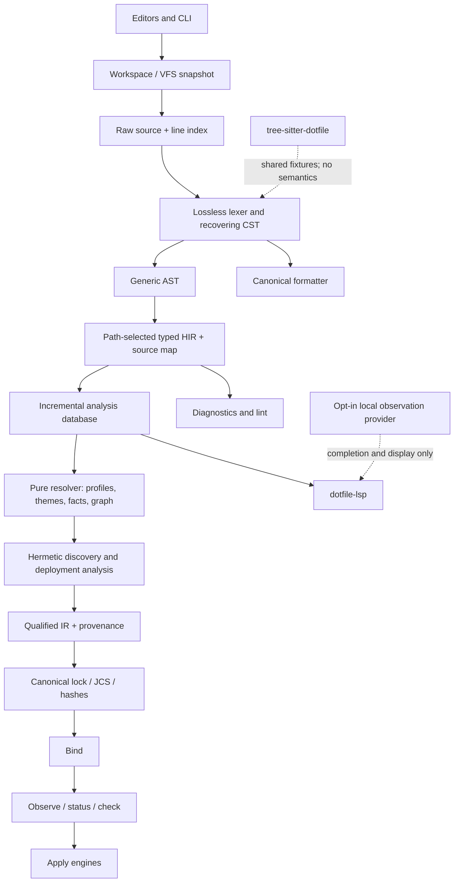

# `.dotfile` v1 implementation plan

**Status:** Work is ongoing in branch "dotfile-language"

**Normative basis:** [`docs/dotfile-language.md`](./dotfile-language.md)

**Target tuple:** `.dotfile` 1 / generated lock 1 / built-ins 1

## 1. Outcome and scope

The goal is one conforming `.dotfile` implementation with one semantic source of truth, exposed
through the CLI, editor tooling, and runtime consumers. “Complete” means all authored and generated
domains in the specification are supported, not only the package requirement syntax.

The program delivers four products:

1. A language core: version bootstrap, lossless lexer/CST, recovering parser, typed domain lowering,
   resolver, deployment analysis, provenance-rich IR, canonical lock reader/writer, formatter, and
   lint engine.
2. An editor platform: one native LSP server, thin editor clients, semantic navigation, inlay hints,
   document links, safe code actions, generated-file awareness, and optional environment-enriched
   completion.
3. A syntax integration: `tree-sitter-dotfile` with highlighting, locals, folds, and indentation.
4. A conforming runtime: bind, observe, check, status, dry-run, user apply, and separately gated
   system apply with the ledger, redaction, race, rollback, and privilege boundaries from the spec.

The language/editor release and mutating-runtime release have separate gates. The language,
formatter, lock compiler, non-destination-mutating CLI, and LSP can stabilize before apply is
enabled. `fmt`, `lock`, and explicit refactors may still write repository sources atomically; this
track never mutates bound machine destinations. The product must not claim full runtime conformance
until the mutation safety gates pass.

## 2. Decisions to make before implementation

These decisions prevent the parser, compiler, LSP, and documentation from drifting.

1. **Rust is the authoritative implementation language.** The repository already has a Rust
   workspace, Rust is suitable for a native LSP and no-follow filesystem work, and the same core can
   be built for native and limited WASM use. Existing Python commands remain only during migration.
2. **There is one authoritative parser.** CLI, compiler, formatter, linter, and LSP all consume the
   same lossless CST and typed lowering. Tree-sitter is a structural editor grammar, never a second
   semantic implementation.
3. **The parser is recovering; compilation is strict.** Parsing always returns a CST with explicit
   error and missing nodes. Any lex/parse error prevents validated compiler IR and lock emission.
   There is no permissive editor-only language dialect.
4. **Spans are byte-first.** The canonical range is a zero-based, half-open `u64` byte range over the
   raw source. A shared line index derives the spec's one-based Unicode-scalar coordinates and the
   negotiated LSP UTF-8/UTF-16 positions.
5. **Schemas are shared data; semantic algorithms remain explicit code.** Attribute legality,
   value/reference types, singleton status, formatting order, completion text, and documentation
   live in a versioned schema registry. Fact merging, graph cycles, discovery, mappings, variants,
   collisions, and safe application remain reviewable algorithms.
6. **Compiler and machine inputs are separated by types and dependencies.** No compiler API accepts
   environment, clock, hostname, PATH, installed tools, network, random state, saved machine state,
   destination state, or vault plaintext.
7. **Only `Error` and `Warning` are diagnostic severities.** Informational state is shown through
   hover, inlay hints, code lenses, status views, or command output.
8. **Generated ownership is determined by domain context.** A banner or basename alone is not enough.
   The generated lock, benchmark baseline, and registered theme outputs have distinct ownership and
   editing policies.
9. **One native LSP server serves all domains.** `dotfile-lsp` is the reference server and
   `dotfile lsp` may be a wrapper. Editor-specific extensions stay thin. A later WASM build is
   syntax/schema-only unless it has a real repository snapshot.

Before code is merged, record short ADRs for parser recovery, span/offset representation, warning
code-to-`detail` mapping, CLI exit/JSON contracts, generated ownership, supported version windows,
symbolic variant analysis, and platform support for guarded replace/prune. M0 must also freeze the
renderer registry schema, benchmark producer interface, LSP 3.17 protocol floor, supported artifact
matrix, and named performance reference machines.

## 3. Current repository and migration constraint

The repository is not currently v1 source. Among other gaps:

- `config/profiles.dotfile` has no required `@dotfile-version = "1"` preamble or v1 group/profile
  declarations;
- requirements, pins, package descriptions, and deployment targets are split across legacy files;
- facet and variant `package.dotfile` files do not yet carry v1 semantics;
- theme sources are TOML rather than the specified `.dotfile` domains;
- current Python readers are line/block-specific and do not provide the unified CST, spans,
  recovery, or provenance required by v1.

The new implementation must reject this state as v1 rather than silently reinterpret it. Develop
against repository-shaped v1 fixtures while the current Python CLI remains operational. Migrate
sources and switch the command entry point in one reviewed cutover after shadow validation. Do not
maintain a second long-lived legacy parser.

## 4. Architecture

The dependency graph must make a hermeticity violation difficult to express. `dotfile-semantics`,
`dotfile-deploy`, `dotfile-ir`, and `dotfile-lock` must not depend on observation, process execution,
account lookup, machine state, or network modules.

### Proposed Rust packages

| Package | Responsibility |
|---|---|
| `dotfile-source` | `FileId`, strict repository paths, raw bytes, `u64` ranges, line indexes, versions, diagnostics |
| `dotfile-syntax` | byte lexer, trivia gaps, recovering parser, immutable CST, generic AST |
| `dotfile-schema` | domain classifier, v1 schema registry, tolerant typed HIR, bindings, bidirectional source map |
| `dotfile-theme` | typed shared roles/fonts, profiles, maps, merges, joins, cross-profile checks |
| `dotfile-semantics` | namespaces, groups/profiles/hosts, occurrences, facts, checks, coordinates, graphs, explain traces |
| `dotfile-repo` | immutable Git index/worktree snapshot, tracked-ignore behavior, no-follow source discovery |
| `dotfile-deploy` | leaves, transforms, mappings, variants, permissions, overlays, collisions |
| `dotfile-ir` | typed records, qualified IDs, provenance, canonical ordering inputs |
| `dotfile-lock` | strict lock reader, canonical text/JCS writers, IDs, digests, freshness/tamper comparison |
| `dotfile-format` | comment attachment, schema-aware ordering, 100-scalar pretty printer |
| `dotfile-analysis` | incremental query database, indexes, immutable snapshots, cancellation |
| `dotfile-lsp` | LSP transport and adapters over `dotfile-analysis` |
| `dotfile-bind` | explicit host/profile/variant/home/OS/architecture/filesystem binding |
| `dotfile-observe` | normative bounded command/font/service/path observation for explicit runtime checks |
| `dotfile-env` | trust-gated, cached, non-authoritative environment snapshots for LSP enrichment only |
| `dotfile-apply` | plans, ownership ledger, journals, guarded user operations, redaction |
| `dotfile-helper` | minimal separately audited privileged system-copy helper |
| `dotfile-cli` | commands and stable human/JSON output contracts |
| `dotfile-test-support` | repository fixtures, fake Git/filesystem/machine adapters, golden utilities |

Keep `tree-sitter-dotfile` and editor clients as separately versioned distribution packages that
consume the same fixture corpus.

## 5. Unified syntax pipeline

### 5.1 Raw source and spans

The lexer operates on bytes so malformed UTF-8, misplaced BOMs, bare CR, and controls receive exact
ranges. A leading BOM is retained as preamble trivia for CST losslessness but discarded by semantic
processing and formatting. A CRLF is one `NL` token spanning two bytes.

The source layer exposes three coordinate systems through one line index:

- raw zero-based byte offsets for tokens, CST, semantic anchors, lock IDs, and hashes;
- one-based Unicode-scalar line/column pairs for normative `source_span` encoding;
- negotiated zero-based UTF-8 or UTF-16 LSP positions at the protocol boundary.

Every Unicode/CRLF test must round-trip between these coordinate systems.

### 5.2 Lossless lexer and CST

Use a hand-written byte lexer because the comment boundary, compound keywords, path precedence,
sigil adjacency, interpolation, and strict invalid-byte behavior are part of conformance.

The token stream contains significant tokens and exactly `tokens + 1` ordered trivia gaps. Gaps own
horizontal whitespace, comments, and optional preamble trivia. `NL` remains significant. Replaying
gaps and token byte slices must reproduce the original bytes exactly.

Strings remain one grammar token but carry a side table of decoded text, escapes, interpolation
names, and subspans. Quoted paths likewise retain decoded values and inner spans. This supports
binding rename/navigation and canonical formatting without reparsing token text.

Required lexer fixtures include every §6 edge and its immediate negative neighbor, especially:

- the whitespace-sensitive comment rule and `word#not-a-comment`;
- contextual `WORD` validation, reserved words, and digit-leading identifiers;
- exact `@let`/`@extend` recognition and malformed neighbors;
- adjacent `@`, `$`, and `?` rules;
- `PATHREF` precedence, bare/quoted path forms, and invalid components;
- every escape, Unicode scalar boundary, interpolation form, and literal `${` spelling;
- BOM, LF/CRLF, bare CR, invalid UTF-8, and C0/C1 controls.

### 5.3 Recovering parser

Use deterministic recursive descent with an event builder. Nodes mirror the generic grammar:
declarations, attributes, sigil blocks, named entries, path entries, blocks, lists, string
expressions, variable references, error nodes, and zero-width missing tokens.

Recovery rules are deterministic and bounded:

- synchronize a file/block body at comma, newline run, matching `}`, or EOF;
- synchronize a list at comma, `]`, or EOF and recover a newline-separated value as a missing comma;
- insert a missing closer at EOF or before a valid outer delimiter;
- wrap an unexpected closer in an error node rather than allowing it to close multiple levels;
- poison only the smallest uncertain subtree and suppress only dependent semantic diagnostics;
- on each loop, consume a token or insert one missing token, guaranteeing forward progress;
- cap diagnostics/work for adversarial files without panicking or recursing without bound.

The recovery ADR must make the remaining mechanics executable: an unparsed tail is one lossless
`ErrorNode`; a missing token is anchored at the zero-width insertion range `p..p`; poison propagates
only through HIR fields that consume the erroneous node; and CST replay still includes every invalid
byte. It must define tested depth/work limits and a separate LSP publication cap without silently
turning a resource limit into a new v1 syntax rule. For malformed on-disk UTF-8, diagnostics retain
the exact byte range and derive line position from raw newline scanning; LSP ranges are clamped to
the valid client text representation and retain the raw byte range in diagnostic data. EOF, BOM,
CRLF, astral, and combining-character anchors require explicit golden vectors.

The same parser handles every domain. For example, `?@font` is valid generic syntax and a domain
schema decides whether the optional sigil is legal there. Desugaring occurs only after parsing.

### 5.4 CST, AST, HIR, and IR boundaries

1. **CST:** lossless bytes, trivia ownership, missing/error nodes, no domain meaning.
2. **Generic AST:** typed zero-copy views of grammar productions.
3. **Typed HIR:** file-path-selected schema, contextual references, binding scopes, sugar expansion,
   partial poison values, and a bidirectional source map.
4. **Compiler IR:** qualified identities, contributions, occurrences, resolutions, mappings,
   candidates, provenance, and stable IDs.

Never use CST node identity in serialized IDs. Stable IDs use the exact semantic spans and byte
algorithms in §22.

## 6. Domain schemas and semantic engine

### 6.1 Bootstrap and domain routing

Bootstrap skips exactly one accepted UTF-8 BOM at byte offset zero, then recognizes only the exact
ASCII preamble in `config/profiles.dotfile`, selects source v1, and parses/validates enough of the
group map to classify dynamic group-root, facet, and variant sources. A second or misplaced BOM is a
lexing error; fixtures cover no BOM, one leading BOM, multiple BOMs, and misplaced BOMs.
Classify by canonical repository-relative path and validated layout, not by matching file contents.

The registry must cover:

| Domain | Required typed support |
|---|---|
| Profiles/groups/defaults | bootstrap version, nesting/ancestry, directories, managers, OS/arch, theme defaults |
| Hosts | aliases, roles, profile/theme refs, extension fact fields |
| Group/facet requirements | bindings, demands, resources, extensions, facet attributes, paths |
| Override variants | inherited deployment metadata, path nodes, no demands/facts |
| Recipient keys | closed `recipients` block and age public-recipient validation |
| Scan rules | ordered closed rule records and the v1 glob language |
| Benchmark baselines | generated host/epoch/run-ID correlation and ordering |
| Theme roles/fonts | open maps inside closed structures, required fields, decimals/enums |
| Theme profiles | required identity data, complete palettes, sparse overrides, global validation |
| Five theme maps | exact per-file record schemas, references, joins, and ordered records |
| Generated lock | exact sections, records, field order, conditional fields, canon, hashes |

An unknown repository-owned `.dotfile` path is a `schema/context` error. A detached editor buffer may
receive syntax-only v1 support, but it must not claim repository semantic validation.

### 6.2 Names, bindings, and provenance

Use distinct typed namespaces for groups, profiles, facets/variants, entities, resources, facet
paths, hosts/aliases, themes, and file-local bindings. Bare values resolve only in the namespace
assigned by their schema position; quoted values remain data.

The entity namespace is open. A new dependency-position name declares an identity and is never an
unresolved-reference error. Near-name analysis remains a warning. Extensions must target a normal
declaration elsewhere.

Each root/block owns a lexical binding scope with ordered declarations and a prologue boundary.
Retain segment-level provenance through string evaluation and definition/reference edges for hover,
rename, unused-binding lint, and interpolation.

Represent resolved values as `Provenanced<T>` with a closed v1 built-in rule enum. Keep effective
origins used by the lock separate from a richer explain trace containing inherited, shadowed,
coalesced, and conflicting contributions.

### 6.3 Pure semantic pipeline

Implement and test the normative stage order:

1. Bootstrap, classify, parse, and typed-lower all known files.
2. Resolve every theme profile and all registered maps, including global palette rules.
3. Build namespace tables and resolve typed references/extensions.
4. Expand group ancestry and every declared profile; validate manager, OS, and architecture.
5. Build demand occurrences before folding identities; propagate optionality and reason chains.
6. Collect every fact contribution and perform per-profile scoped merging.
7. Infer/validate check shapes, coordinates, adapters, versions, and package aggregation.
8. Detect active per-profile cycles and report the complete cycle and all origins.
9. Discover facets, variants, tracked ignores, payload leaves, source types, and vault identity.
10. Apply filename transforms, longest-prefix mappings, coverage, deployment inheritance, modes,
    ownership, and provenance.
11. Validate variants, deduplication, overlays, exact/prefix/case/Unicode collisions for every
    profile and satisfiable variant combination.
12. Build a sealed validated IR and canonical lock only if no error exists.

Do not hide later independent errors when their inputs remain well-defined. Do not fabricate
downstream errors from poisoned values.

### 6.4 Hermetic repository snapshot and incremental queries

The compiler receives one immutable snapshot exposing only source bytes, the Git index, tracked
ignore bytes, no-follow metadata, raw symlink targets, and verified regular-file bytes. It has no
generic environment, Git configuration, process, or network API.

The analysis database caches queries such as parse/lower per file, bootstrap topology, theme
inventory and resolution, workspace symbols, group ancestry, expanded profiles, occurrences, fact
contributions, profile node resolution, profile graph, facet inventory, deployment candidates,
profile deployments, complete IR, and canonical lock.

Use immutable revision snapshots, one serialized change coordinator, monotonic revisions,
cancellation, deterministic collection, and stable byte sorting. Parse/lower files and resolve
independent profiles/facets in parallel, but prove serial and parallel output equality.

Important invalidation boundaries:

- changing profiles invalidates topology, classification, profile resolution, discovery, and lock;
- changing one facet invalidates that facet and profiles that activate its group;
- variant metadata never invalidates the semantic dependency graph;
- theme profile filenames affect theme inventory and lock structure, while most theme content affects
  typed theme resolution and renderer drift but not the lock;
- plain linked-file byte changes do not affect the lock; copy/SOPS/template bytes do;
- machine/environment changes invalidate only observation-backed editor views.

Use a symbolic activation predicate for variant collision analysis rather than eagerly expanding a
potentially exponential Cartesian product. Differential-test it against brute-force enumeration of
generated small cases.

## 7. Formatter and linting

### 7.1 Formatter

The formatter consumes the lossless CST and a path-selected `FormatSchema`. It refuses lex/parse
invalid input but is total over parse-valid, schema-invalid files. It must preserve invalid/unknown
entries, duplicates, keyless resource blocks, and their stable relative order while still producing
canonical syntax.

Pipeline:

1. derive comment attachments from trivia gaps;
2. build tolerant format items with original ordinal and optional schema sort key;
3. canonicalize valid strings, interpolation, and path spellings;
4. apply stable domain ordering without changing ordered semantic lists/maps/records;
5. render through a document algebra whose width is Unicode scalar count;
6. reparse output and verify semantic equivalence in tests.

Ship whole-document formatting first. Do not advertise range or on-type formatting until a range can
expand to a complete independently formatted region without violating global ordering or comment
attachment.

`package.lock.dotfile` never passes through the authored-source formatter. `fmt --check` verifies
its canonical bytes; mutating `fmt` refuses it and directs the user to `dotfile lock`.

### 7.2 Lint engine and severity

Linting is the warning-producing view of the same analysis engine, not a separate AST walk. Map every
§24.2 warning to an existing stage-owned diagnostic code plus a frozen structured `detail`; v1 must
not invent `lint/*` codes.

| Intrinsic severity | Use |
|---|---|
| Error | Every normative rejection; blocking theme/schema errors; malformed/noncanonical/tampered lock; explicit required machine-check failure |
| Warning | §24.2 warnings; stale lock in the editor; optional absence; non-blocking drift |

Informational facts never become a third diagnostic severity. Warning promotion is caller/CI policy
and does not change intrinsic diagnostics or language semantics.

Expose the engine through LSP and a dedicated read-only `dotfile lint` command. Amend §25 before
beta to register the command without changing source v1. It reuses the same human/JSON diagnostic
schema, accepts `--deny-warnings` as caller policy, never performs bind/observe/apply, and never
becomes a second validation pass.

## 8. LSP plan

### 8.1 Server and protocol

Ship one `dotfile-lsp` native stdio server. It reports supported source/lock/built-ins versions and
shares the exact release/core libraries with `dotfile`. Use incremental document sync, workspace
folders, immutable snapshots, cancellation, stale-result suppression, and current document versions
for edits. Prefer pull diagnostics with push fallback.

Advertise:

- completion and lazy resolution;
- hover, definitions, references, prepare-rename/rename;
- document/workspace symbols;
- full/range semantic tokens and deltas;
- document highlights, selection ranges, folding ranges, and linked editing where syntax permits;
- inlay hints and lazy resolution;
- document links and lazy resolution;
- code actions and lazy resolution;
- whole-document formatting;
- watched file create/delete/rename handling and safe `willRenameFiles` support;
- commands for lock regeneration/diff, provenance, environment-index refresh, and theme checks.

Thin clients should include VS Code first, then documented Neovim, Helix, Emacs, and Zed setup. An
optional later WASM package may offer syntax, formatting, and local schema help but cannot claim full
repository analysis without Git/discovery access.

### 8.2 Feature behavior

| Feature | Required behavior |
|---|---|
| Diagnostics | Exact codes/stages/order, tight primary ranges, related origins, expected/actual data, remedy, redaction, scope (`source`, `generated`, `machine`) |
| Completion | Context-legal attributes/blocks/enums/snippets, visible bindings, typed references, theme keys, eligible repository paths, canonical quoting |
| Hover | Syntax docs plus qualified identity, merge/default rules, per-profile resolution, mapping/deploy preview, provenance, generated freshness |
| Definition/reference | Namespace-aware definitions and uses; interpolation subspans; lock source/provenance back-links |
| Rename | Preflight the edited overlay; reject collisions/reserved names; annotate behavior-changing file/directory renames; never edit the lock |
| Symbols | Domain hierarchy in documents and qualified workspace symbols (`group:`, `profile:`, `facet:`, `entity:`, and others) |
| Semantic tokens | Standard token types with `declaration`, `readonly`, `defaultLibrary`, plus minimal `optional`/`generated` modifiers |
| Inlay hints | Qualified IDs, effective optionality, inferred checks/coordinates, mappings/destinations, variants, profile ancestry, themes, provenance |
| Document links | Repository `PATHREF`, group directories, exact scan paths, theme files, lock sources/spans, physical/vault sources within the workspace |
| Formatting | One canonical whole-document edit for authored parse-valid sources; no edit for the generated lock |
| Code actions | Compiler-authored fix-its, conflict navigation, safe scaffolding, formatting, lock regeneration/diff, theme check/switch previews |
| Generated awareness | Read-only lock intelligence; producer-oriented benchmark behavior; renderer-owned theme output links |

When values differ by profile, hover/hints show a compact table or “varies by profile.” An optional
analysis-profile setting changes presentation only; every declared profile is still validated.

Inlay hints anchor only after the identity/header/value token they explain, never inside trivia or a
poisoned subtree. Requests honor the requested range, categories are independently configurable,
duplicate information already written in source is suppressed, and expensive per-profile/provenance
tables resolve lazily from immutable snapshots. Golden tests fix anchor positions, suppression, and
multi-profile labels for every hint category.

### 8.3 Environment-aware completion

Environment enrichment is opt-in, disabled for untrusted workspaces, local-only, cancellable, and
clearly labeled “observed on this editor host/container.” Deterministic schema/repository candidates
always rank first.

Allowed observations include PATH command basenames, installed package names for a selected built-in
installer, fonts, service labels, local user/group names, OS/architecture, matched host, saved
profile/variant display, and prefix-bounded local path suggestions.

The provider must:

- use fixed built-in adapters or OS APIs, never a shell, repository code, remote search, or arbitrary
  source-provided argv;
- run with sanitized environment, strict time/output limits, TTL caches, and cancellation;
- disclose when the server environment is remote/containerized;
- never create compiler diagnostics, defaults, fix-its, lock data, generated bytes, or automatic
  version pins;
- degrade silently to deterministic completion when unavailable;
- never decrypt or preview vault/private content.

Use a one-way `EnvironmentProvider -> EnvironmentSnapshot -> LSP enrichment` interface located in a
crate the compiler cannot depend on. VS Code passes its workspace-trust decision; generic clients
remain `off` unless the user explicitly enables `dotfile.completion.environment`. Snapshots record
whether observation occurred on the local server, remote host, container, or an explicitly supplied
sanitized client snapshot. Keep caches in memory only, keyed by server-environment identity,
workspace, built-ins version, selected analysis profile, and adapter; default TTL is five minutes
with explicit refresh and cancellation. Cache failure/expiry falls back to deterministic results.

An explicit completion insertion becomes ordinary authored source. Before insertion, observations
must be unable to affect parsing, formatting, reference/rename results, compiler IR, or lock bytes.

### 8.4 Document links and code-action safety

Use definition navigation when an exact semantic range exists and document links for file targets.
Do not automatically link `~/...`, absolute destinations, entity machine paths, service labels,
packages, or recipient material. A separate opt-in reveal command may use the observation provider.
All file links must remain inside the workspace and must not silently follow unsafe symlinks.

Safe automatic actions include an exact version preamble, a proven missing delimiter/comma, quoting
for a known type mismatch, a missing resource-key skeleton, a unique enum/near-name replacement, an
identical duplicate removal, a verified unused binding removal, facet metadata scaffolding, and
unambiguous forbidden/missing deployment attributes.

Collision repair, graph-cycle changes, owner/group selection, marker migration, palette invention,
theme “everything” switches, and directory/package renames require preview and confirmation. Never
offer destination apply/system install as automatic or on-save actions. Do not ship a broad semantic
fix-all.

Machine-applicable fixes return versioned `WorkspaceEdit.documentChanges`. Risky source refactors
return a command that first computes a read-only canonical diff and annotations, then requires an
explicit second confirmation before applying the same version-checked edit. If the document revision
changes, discard the preview. No LSP confirmation flow authorizes machine destination mutation.

## 9. Generated-file awareness

Maintain a central ownership index used by the CLI, formatter, LSP, rename, and code-action layers.

| File role | Read/navigate | Diagnose | Source formatter | Direct rename/fix | Authorized producer action |
|---|---|---|---|---|---|
| `package.lock.dotfile` | yes, including provenance | strict lock/freshness diagnostics | check only; no edit | never | `dotfile lock`, after relevant buffers are saved |
| `benchmarks/baselines.dotfile` | yes | benchmark schema diagnostics | yes, using benchmark ordering | syntax fixes only; no semantic host/epoch rename | benchmark record/update command |
| Registered native theme output | yes; link to facet/theme inputs | renderer drift only | no `.dotfile` formatting | never through `.dotfile` LSP | `dotfile theme apply`, then relock if a materialized digest changed |
| Human/tool override source | yes | normal source diagnostics | yes | normal safe source actions | ordinary authored edit/tool scaffold |

### `package.lock.dotfile`

- Identify by exact workspace role and validate the strict generated schema/banner/canon.
- Permit diagnostics, symbols, semantic tokens, hover, provenance, and source navigation.
- Disable completion, rename, direct fixes, and formatting edits.
- Report `lock/noncanonical` and `lock/tampered` as errors.
- Report `lock/stale` as an editor warning only after current source compilation succeeds.
- Offer only explicit regeneration, canonical diff, source navigation, and provenance actions.
- Never let an LSP workspace edit mutate the lock; regeneration is a command using saved disk state.

### Other generated ownership

- `benchmarks/baselines.dotfile` is producer-owned: the normal formatter and syntax-only fixes are
  allowed, but semantic host/epoch/run changes and renames are producer commands.
- Registered theme-native artifacts are renderer-owned according to the explicit renderer registry,
  never guessed from paths. Link drift to the owning facet and theme source. Theme content drift is
  not lock staleness until a materialized generated artifact changes and its digest must be relocked.
- Override files may be human/tool-authored and are not generically read-only.

If relevant source buffers are unsaved, the LSP may show a preview compile but must not claim that the
on-disk lock is current or regenerate a lock said to represent those unsaved bytes.

## 10. Tree-sitter plan

Implement the generic token grammar only. Use an external scanner where needed for the whitespace-
sensitive comment rule, exact compound keywords, and lexical adjacency. `NL` is significant, not an
extra; horizontal whitespace/comments are extras in the tree-sitter grammar even though the
authoritative CST owns them as gaps.

Ship:

- named nodes aligned with the generic CST;
- string escape/interpolation children;
- `highlights.scm`, `locals.scm`, fold and indent queries;
- native and WASM builds plus `node-types.json`;
- editor packages for the supported integrations.

For every parse-valid conformance fixture, normalize the authoritative CST and tree-sitter tree to a
common skeleton and require equivalent structure and byte ranges. Negative fixtures only require a
nearby tree-sitter `ERROR`; recovery trees need not match. Random incremental edits must produce the
same tree as a fresh tree-sitter parse.

## 11. Bind, observe, and apply runtime

Keep runtime stages downstream of a validated, canonical lock.

1. `dotfile-bind` accepts an explicit `BindContext`: profile/host selection, variants, invoking
   identity, home/XDG anchors, OS/architecture, account resolution, and filesystem capabilities.
2. `dotfile-observe` implements only fixed built-in adapters with bounded argv, sanitized PATH and
   locale, timeouts, output limits, and no shell.
3. Read-only `status`, `check`, `why`, `graph`, and package emission stabilize before mutation.
4. Introduce one immutable `BoundPlan` builder used by dry-run and, later, apply. At bind/observe
   beta, dry-run must have deterministic reviewed plan goldens and produce zero mutations; exact
   dry-run/apply parity becomes a repeated gate when each apply engine lands.
5. User apply adds the owner-only state directory, canonical ledger, object tokens, private HMAC
   verifier, descriptor-relative no-follow operations, no-replace creation, journal, and rollback.
6. System apply uses a separately reviewed minimal helper receiving only an approved plan and opened
   descriptors. It performs no parsing, network, shell execution, or decryption.

Run a platform feasibility spike for the specified linearizable guarded replace/prune primitive at
the start of the program. Where the OS/filesystem cannot provide the contract, conforming behavior is
to refuse automatic replacement/prune and require the separately confirmed backup/adopt workflow;
never weaken the operation to check-then-rename.

All root/system tests run only in disposable VMs. Secret canaries must prove private bytes never
appear in lock data, argv, environment, diagnostics, hover, links, logs, diffs, temporary names,
ledgers, crash output, or test artifacts.

## 12. Conformance and quality strategy

Create one versioned, repository-shaped conformance corpus consumed by the lexer, parser, schemas,
compiler, formatter, CLI, tree-sitter, and LSP. Each fixture declares exact input bytes, domain,
simulated Git/filesystem/machine state, operation, expected tokens/CST/diagnostics/IR/lock/edits, and
the normative section it covers.

Required test classes:

- golden token/trivia/CST/recovery dumps, diagnostic JSON, formatter output, lock text/JCS/hashes,
  CLI output/exit status, LSP transcripts, and tree-sitter query captures;
- properties for formatter idempotence/semantic preservation, canonical lock round-trip, stable IDs,
  environment hermeticity, order independence, serial/parallel determinism, incremental/full equality,
  span conversion, and dry-run mutation emptiness;
- fuzzing for arbitrary bytes, nesting/separators/interpolation, parse-format-parse, comment attachment,
  tree-sitter incremental edits, LSP framing/cancellation/version churn, discovery, and helper plans;
- differential tests for authoritative/tree-sitter syntax, incremental/full analysis, textual/JCS lock,
  symbolic/brute-force variants, and modeled/real filesystems;
- integration tests for every CLI command and all §28 fixture families;
- isolated fault/race injection for every application preflight and write step.

The §28 list is the minimum traceability dashboard; no numbered family is “not applicable” for a
full implementation.

### Initial performance gates

Measure on named reference hardware and a fixed interactive corpus (100 files, 10,000 lines, 2,000
semantic nodes) plus a stress corpus (2,000 files, 200,000 lines, 50,000 nodes).

| Operation | Initial target |
|---|---:|
| Server ready | p95 <= 400 ms |
| Full parse, interactive corpus | p95 <= 50 ms |
| Warm full compile/validate | p95 <= 500 ms |
| Cold lock build with discovery/hashing | p95 <= 1.5 s |
| Incremental syntax diagnostics | p95 <= 50 ms, excluding debounce |
| Incremental semantic diagnostics | p95 <= 200 ms |
| Repository/schema completion | p95 <= 75 ms |
| Environment completion | p95 <= 250 ms hard deadline, then cached/fallback results |
| Inlay hints/document links | p95 <= 100 ms |
| Format a 2,000-line file | p95 <= 50 ms |
| Typical long-lived LSP memory | <= 200 MiB |
| Stress full compile | <= 5 s and <= 512 MiB |

Performance is informational on noisy pull-request workers and blocking on dedicated nightly/release
workers. Adversarial parsing must be bounded and show no superlinear trend.

### Platform and integration matrix

- Release native CLI/LSP artifacts for macOS ARM64/x86-64 and Linux x86-64/ARM64. M0 freezes minimum
  OS/libc versions and the exact signing/install channels.
- Run language, formatter, lock, and LSP conformance on macOS and Linux. A Windows x86-64
  syntax/formatter/LSP build is desirable but not a v1 runtime gate; it must preserve POSIX source
  semantics and clearly report bind/apply as unsupported.
- Bind/observe/apply v1 supports only the specified Darwin and Linux profiles. Any other target fails
  before planning and never partially applies.
- Release testing covers case-sensitive and case-insensitive APFS plus a named Linux filesystem;
  nightly capability tests cover additional filesystems and fail-closed guarded-operation behavior.
- M0 records the benchmark producer command/API, renderer output-to-facet registry format, one named
  macOS ARM64 performance host, and one named Linux x86-64 performance host before SLOs become gates.

## 13. Delivery roadmap

Effort ranges assume three engineers: one syntax/compiler lead, one formatter/LSP/editor lead, and
one repository/runtime/security lead, with part-time QA/documentation support. Ranges are planning
bands, not commitments. Workstreams overlap after the syntax and schema contracts stabilize.

| Milestone | Deliverables | Depends on | Exit gate | Team effort |
|---|---|---|---|---:|
| M0 Contract freeze | ADRs, version registry, schema/diagnostic inventories, fixture manifest, CLI JSON/exit contract, apply feasibility spike | none | Every normative MUST has an owner/test plan | 2-3 weeks |
| M1 Source and syntax | raw source, spans/line index, lexer, lossless CST, recovery, generic AST | M0 | Exact byte replay; grammar/negative fixtures; bounded fuzzing | 4-6 weeks |
| M2 Typed domains and formatter | domain bootstrap/classifier, all immediate schemas, bindings, source map, canonical formatter | M1 | Every allowed/forbidden context; formatter idempotence/comment goldens | 5-7 weeks |
| M3 Semantic compiler | namespaces, groups/profiles/hosts, themes, occurrences, facts, adapters, graphs, explain traces | M2 | Every profile/theme resolves; provenance and stable-ID goldens | 6-8 weeks |
| M4 Discovery, deploy, and lock | Git snapshot, ignores, leaves, variants, mappings, permissions, collisions, IR, JCS, canonical lock | M3 | §16-22 fixtures; hermeticity; byte-identical lock across platforms | 7-10 weeks |
| M5 Non-destination CLI and lint | `lock`, `lock --check`, `fmt`, `fmt --check`, `why`, `graph`, packages, human/JSON diagnostics, warning policy | M4 | Atomic repository writes/no-write-on-error pass; machine destinations remain untouched | 3-5 weeks |
| M6 LSP alpha/beta | protocol foundation, diagnostics, completion, navigation, symbols, tokens, hints, links, formatting, safe actions | M2-M5 incrementally | Full/incremental equality; client smoke tests; generated lock protected | 7-10 weeks, parallel |
| M7 Tree-sitter and clients | grammar/scanner/queries, VS Code package, generic client docs, optional WASM syntax build | M1-M2 | Differential corpus and incremental tree tests pass | 3-5 weeks, parallel |
| M8 Editor hardening | opt-in environment provider, generated ownership matrix, risky-action previews, packaging/privacy hardening | M4, M6 | Environment invariance; generated edit refusal; preview/version tests | 3-5 weeks |
| M9 Bind and observe beta | host/profile/variant bind, fixed adapters, status/check, package queries, immutable planner, complete dry-run | M4-M5 | Bind/adapter suites, deterministic plan goldens, and zero dry-run mutations | 4-6 weeks |
| M10 User-apply beta | user ledger/HMAC, guarded operations/refusal, journals, rollback, adoption path | M9 + M0 feasibility | User dry-run/apply plan parity, race/fault/redaction suites, and rollback drills | 6-9 weeks |
| M11 System-apply beta | approved-plan protocol, opened descriptors, minimal privileged helper, system ownership/permission paths | M10 + M0 feasibility | System dry-run/apply plan parity, helper fuzz/fault suites, and independent security review | 6-10 weeks |
| M12 Language/editor stable | signed server/clients, versioned docs, conformance kit, staged-v1 two-week shadow period | M5-M8 | All language/editor gates pass on staged v1 workspaces | 2-3 weeks |
| M13 Repository cutover | explicit migration, theme conversion, atomic source/CLI cutover, first lock; apply remains explicitly feature-gated | M10, M12 | Semantic parity approved; clean lock reproduction; source/CLI rollback rehearsed | 3-5 weeks |
| M14 Full runtime GA | enable stable user/system mutation and publish final operations/security material | M11, M13 | All full-runtime gates, user/system dogfood, and rollback rehearsals pass | 2-3 weeks |

With this staffing, a non-destination compiler/formatter/LSP beta is roughly a 7-10 month program and
the fully gated mutating runtime roughly 12-16 months. A solo implementation should be planned as
roughly 24-36 months. Scope changes to the normative v1 spec reset affected estimates and fixtures.

### Critical path and parallel work

There are four explicit release paths:

- non-destination compiler beta: M0 -> M1 -> M2 -> M3 -> M4 -> M5;
- language/editor stable: that path converges with M6 -> M8 and M7 at M12;
- user-mutation beta: M4 -> M9 -> M10, behind an experimental gate;
- repository cutover: M10 and M12 converge at M13 while mutation remains feature-gated;
- system/full GA: M10 -> M11 converges with M13 at M14.

Tree-sitter starts once token contracts stabilize. Formatter and initial LSP protocol work start once
CST/gap ownership stabilizes. Semantic LSP providers land incrementally as M3/M4 queries appear.
Apply design can prototype fake filesystem contracts early, but no mutation ships before validated
lock, bind, and the relevant user or system safety gate.

## 14. Repository cutover

1. Characterize current Python command behavior with existing tests and frozen migration examples.
2. Freeze the bootstrap invariant: a missing or unsupported preamble yields the registered stable
   diagnostic/detail and never invokes a legacy fallback. Legacy reading is available only through
   the explicit `dotfile migrate --from legacy` workflow.
3. Build that legacy-to-v1 migrator using the old readers only as migration inputs. It emits
   proposed v1 sources through the new typed writer/formatter and produces an explicit loss/change
   report; `--check` is read-only and `--write` requires the reviewed preview.
4. Generate group/profile/host declarations, group-root and facet `package.dotfile` files, variants,
   keys/scan/baseline files, and all theme `.dotfile` definitions in a staging tree.
5. Compile the staging tree, review every warning, `why` trace, profile graph, package coordinate,
   deployment destination, mode, and theme assignment against current intent.
6. Make shadow comparison semantic, not merely textual. For every profile compare active groups,
   required/optional demand and reason sets, install coordinates, checks, destinations/actions/modes,
   variant inventories, theme assignments, and dry-run operations. Classify every difference as
   preserved, intentional v1 change, or blocker and require reviewed sign-off. Separately require
   byte-stable v1 lock output from clean checkouts. Do not mutate the live machine.
7. Rehearse migration and rollback on macOS and Linux. Preserve the previous release and source tag.
8. Land one cutover commit that switches the `dotfile` entry point, installs v1 sources and the first
   canonical lock, converts theme inputs, and removes obsolete resolution readers/files.
9. Keep Python peripheral consumers only if they consume typed output from the Rust core; they must
   not retain an independent `.dotfile` parser. Port security-sensitive runtime paths to Rust before
   system-apply GA.

## 15. Documentation deliverables

Publish versioned, tested documentation:

- the normative language reference and version tuple compatibility table;
- quick start and tutorials for profiles, facets, demands/resources, mappings, private/template
  leaves, variants, themes, and editor setup;
- formatter, lint, LSP, tree-sitter, environment-completion privacy, and generated-file guides;
- lock lifecycle, stale/noncanonical/tampered recovery, check/status/dry-run/apply/rollback operations;
- a diagnostic catalog keyed by stable code and structured `detail`, including remedy and fix safety;
- contributor architecture for CST/recovery/spans, schemas, incremental invalidation, tests, and
  release/version changes;
- the conformance kit, canonical digest vectors, security/threat model, and migration guide.

Generate hover/completion text, schema tables, CLI help, and diagnostic pages from shared registries
where practical. Extract every example into CI and require it to parse, format canonically, and pass
its stated operation. Before release, give the documentation and plan to a context-free reader and
verify they can explain graph, manager, mapping, variant, lock, generated ownership, and mutation
behavior without unstated project knowledge.

## 16. Release gates and definition of done

### Language/editor stable

- Every source/peripheral domain has positive and negative schema fixtures.
- Parser recovery is lossless, deterministic, bounded, and never admits poisoned nodes into valid IR.
- Formatter output is idempotent and semantics/comment preserving for every domain.
- All pure stages are invariant under locale, clock, environment, hostname, PATH, installed tools,
  enumeration order, supported OS, architecture, and concurrency.
- Canonical text/JCS, IDs, spans, provenance, hashes, and lock bytes match reviewed goldens and
  cross-implementation vectors.
- Incremental analysis equals a clean rebuild after randomized edit sequences; canceled/stale
  revisions never publish.
- LSP features cover every domain, convert positions correctly, preflight all edits, redact secrets,
  and cannot edit the generated lock.
- Environment completion failure or change affects only labeled suggestions/hints.
- Tree-sitter agrees with the authoritative parser on all valid syntax fixtures.
- The relevant §28 conformance families, editor smoke tests, documentation tests, fuzzing, and
  performance gates pass.

### Full runtime stable

- All language/editor gates remain green from a clean checkout.
- Every destination-mutating command independently recompiles and byte-compares the lock.
- Dry-run and apply share the same complete preflight/plan and differ only in mutation execution.
- Foreign paths, ledger changes, symlink/source swaps, no-replace creation, guarded-operation refusal,
  private HMAC, key loss, permissions, approvals, helper validation, journal, and rollback tests pass.
- Unsupported guarded replacement/prune fails closed and directs users to explicit backup/adopt.
- Secret canaries find no private data in any output/state channel.
- An independent security review has no unresolved high/critical finding.
- Real macOS/Linux apply-and-rollback dogfooding completes without unexplained lock or destination
  drift, and the previous release/source state remains a tested rollback path.

## 17. Principal risks and controls

| Risk | Control |
|---|---|
| Authoritative parser and tree-sitter diverge | One shared corpus, normalized-tree differential tests, no tree-sitter semantics |
| Recovery produces cascades or hangs | Explicit sync sets, poison subtrees, diagnostic/work limits, progress invariant, fuzzing |
| Byte/scalar/UTF-16 span corruption | One line index, Unicode/CRLF properties, exact span goldens |
| Formatter moves data/comments incorrectly | Lossless CST, explicit attachment model, semantics/idempotence properties, preview/atomic writes |
| Incremental caches return stale semantics | Immutable revisions, cancellation, stale publication checks, full-rebuild oracle |
| Environment features break hermeticity | Separate modules/input types, trust gate, poison-provider invariance tests |
| Generated files are corrupted | Central ownership index and hard prohibition on direct lock workspace edits |
| Variant analysis becomes exponential or incorrect | Symbolic predicates plus brute-force differential oracle |
| Cross-platform case/Unicode differences | Modeled collision suites, APFS/Linux tests, bind-time actual-volume recheck |
| Canonical lock changes accidentally | Exact byte goldens, independent digest vectors, explicit version transition |
| Warning noise or unstable codes | Frozen code/`detail` registry, evidence/provenance, policy promotion only |
| Race/privilege vulnerability | Mutation ships last, fail-closed primitives, disposable VM tests, minimal helper, security audit |
| Secret leakage | Redaction types, canaries across all channels, no vault plaintext in language/editor core |
| Migration changes behavior | Characterization tests, generated diff/report, shadow lock, atomic cutover, rehearsed rollback |

## 18. First implementation backlog

The first merged work should be deliberately small and contract-heavy:

1. Add the ADR set and a normative-rule-to-owner/test traceability manifest.
2. Create the versioned conformance fixture format and extract all §6-8 examples plus negative
   neighbors as exact raw-byte cases.
3. Scaffold `dotfile-source`, `dotfile-syntax`, `dotfile-schema`, and `dotfile-test-support` in the
   Rust workspace.
4. Implement `SourceText`, `ByteRange`, `LineIndex`, diagnostic data, deterministic ordering, and the
   exact version bootstrap reader.
5. Land lexer token/trivia dumps before the parser so comment, keyword, path, string, and newline
   contracts are reviewable in isolation.
6. Prototype the guarded-replace capability matrix and fake filesystem model in parallel; record
   explicit fail-closed behavior per platform.
7. Freeze current Python behavior tests and a migration input snapshot, but do not convert live
   repository sources until the v1 compiler and lock are ready.
